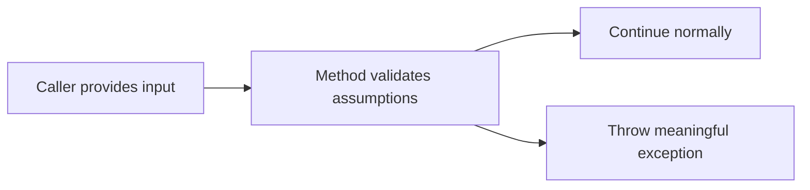

# Exception Design

Exception design is the practice of deciding when code should fail by throwing an exception, what kind of exception should be thrown, and how much useful context should be preserved for the caller.

Original Microsoft Learn reference: [Microsoft Learn C# guide](https://learn.microsoft.com/dotnet/csharp/).

This is a practical topic because poor exception design makes real systems harder to debug, harder to use correctly, and easier to break in confusing ways.

## Why exception design matters

Exceptions are not only about syntax. They are part of API design.

When your code throws, it is telling the caller something important:

- a required precondition was violated
- an operation could not continue safely
- an external resource failed
- a state assumption turned out to be false

## A simple example

```csharp
static decimal Divide(decimal left, decimal right)
{
    if (right == 0)
        throw new DivideByZeroException();

    return left / right;
}
```

This is simple, but practical exception design usually needs more context and more deliberate exception choice.

## Prefer meaningful exception types

Choose exception types that match the kind of problem.

Common examples include:

- `ArgumentNullException` when a required argument is `null`
- `ArgumentException` when an argument is invalid in some other way
- `ArgumentOutOfRangeException` for values outside allowed range
- `InvalidOperationException` when the current object state makes the call invalid
- `IOException`-related exceptions for file and stream problems

## A more realistic example

```csharp
static decimal CalculateDiscount(decimal price, decimal percentage)
{
    if (price < 0)
        throw new ArgumentOutOfRangeException(nameof(price));

    if (percentage is < 0 or > 100)
        throw new ArgumentOutOfRangeException(nameof(percentage));

    return price - (price * (percentage / 100));
}
```

This design helps the caller see what went wrong and where the invalid input came from.

## A useful mental model



Exceptions should express broken assumptions or failure conditions clearly.

## Preserve useful context

When handling exceptions, do not destroy useful information.

For example, this is often a mistake:

```csharp
catch (Exception)
{
    throw new Exception("Something failed.");
}
```

That throws away valuable details.

If you need to wrap an exception, include the original exception as the inner exception.

```csharp
catch (IOException ex)
{
    throw new InvalidOperationException("Failed to load configuration file.", ex);
}
```

## When to throw versus when to return a result

Not every problem should become an exception.

Exceptions are best for conditions that are exceptional, invalid, or unrecoverable in the normal flow.

If absence or failure is an expected ordinary outcome, another design may be clearer, such as:

- returning `bool`
- returning `null` when the API contract clearly allows it
- using `Try...` methods such as `int.TryParse`

## Practical guidance

Good exception design usually means:

- validating public inputs early
- throwing the most specific reasonable exception type
- writing clear messages when they add value
- preserving inner exceptions when wrapping failures
- avoiding exceptions for ordinary expected control flow

## Common beginner mistakes

- Throwing very general exceptions instead of meaningful ones.
- Catching and rethrowing without preserving useful details.
- Using exceptions for ordinary yes-or-no outcomes.
- Ignoring how the caller will diagnose the failure later.

## Summary

- exception design is part of API design and failure design
- choose exception types that match the real problem
- validate arguments and state deliberately
- preserve useful context when wrapping failures
- do not use exceptions for normal control flow when a clearer pattern exists

## Practice

Write a small method that validates two arguments and throws specific argument-related exceptions when needed.

As a second exercise, compare a throwing API with a `Try...` API and explain which one better fits an expected failure versus an exceptional failure.
