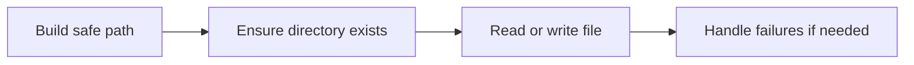

# File and Directory Basics

Working with files and directories is one of the clearest ways to move from pure language syntax into real application behavior. File-system code deals with external state, permissions, missing paths, encoding, and failure cases that do not exist in isolated in-memory examples.

Original Microsoft Learn reference: [Microsoft Learn C# guide](https://learn.microsoft.com/dotnet/csharp/).

That makes it a good place to practice defensive programming.

## Common file-system tasks

Practical C# programs often need to:

- build file paths safely
- create or read text files
- enumerate directories
- check whether files or directories exist
- create folders if needed
- handle missing resources and permission problems

## A simple example

```csharp
string path = Path.Combine(Environment.CurrentDirectory, "notes.txt");
File.WriteAllText(path, "Hello file");
Console.WriteLine(File.ReadAllText(path));
```

This shows the basic shape of file work:

- create a path
- write content
- read content back

## Why `Path.Combine` matters

You should usually avoid building file paths by hand with string concatenation.

```csharp
string path = Path.Combine("data", "reports", "summary.txt");
```

`Path.Combine` is safer and clearer because it handles separators correctly for the platform.

## A more practical example

```csharp
string directory = Path.Combine(Environment.CurrentDirectory, "output");
Directory.CreateDirectory(directory);

string filePath = Path.Combine(directory, "log.txt");

File.AppendAllText(filePath, $"Started at {DateTime.Now}\n");
Console.WriteLine(File.ReadAllText(filePath));
```

This looks more like real application code because it creates a folder when needed and appends to a simple log file.

## A mental model



Real file work is never only about the happy path.

## File operations can fail

File-system code may fail for many reasons:

- the file does not exist
- the directory does not exist
- the process lacks permission
- the file is locked
- the path is invalid
- the disk or external storage is unavailable

That is why practical file code often needs validation and exception handling.

## Reading defensively

```csharp
string path = Path.Combine(Environment.CurrentDirectory, "settings.json");

if (File.Exists(path))
{
    string content = File.ReadAllText(path);
    Console.WriteLine(content);
}
else
{
    Console.WriteLine("Settings file not found.");
}
```

This is not the only valid approach, but it shows the idea that external resources require deliberate handling.

## Files versus directories

It helps to keep the API surfaces separate in your mind:

- `File` is for file-specific operations
- `Directory` is for folder-specific operations
- `Path` is for path construction and inspection

These types are often used together.

## Practical guidance

Good file-system code usually:

- uses `Path.Combine` instead of manual path strings
- validates assumptions about file existence when appropriate
- handles exceptions from external failures
- avoids hard-coded machine-specific paths when possible
- thinks about encoding, overwriting, and append behavior deliberately

## Common beginner mistakes

- Concatenating paths with raw string separators.
- Assuming files always exist.
- Ignoring permission or lock failures.
- Treating file-system code like ordinary in-memory logic with no environmental risk.

## Summary

- file and directory code brings external state into your program
- `Path`, `File`, and `Directory` each play different roles
- practical code should assume file operations can fail
- `Path.Combine` is the normal safe way to build paths
- defensive checks and error handling matter much more here than in toy examples

## Practice

Write a small program that creates a folder, writes a text file into it, then reads the file back.

As a second exercise, list three realistic reasons why that program could fail on another machine even if the code itself is correct.
