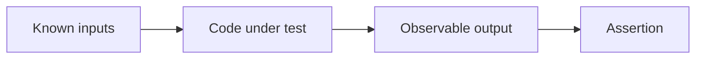

# Testing Basics

Testing helps confirm behavior and protect code from accidental regressions. At a basic level, tests answer a simple question: when this code runs with these inputs, does it behave the way we expect?

Original Microsoft Learn reference: [Testing in .NET](https://learn.microsoft.com/en-us/dotnet/core/testing/).

This is practical because real software changes constantly. Without tests, every change increases the risk of silently breaking something that used to work.

## Why testing helps design

Testing does more than catch bugs. It also pushes code toward clearer design because behavior must be observable, inputs must be controllable, and results must be verifiable.

That often leads to code that is easier to reason about even before the test suite grows large.

## The basic structure: Arrange, Act, Assert

Most unit tests follow a simple pattern.

```csharp
// Arrange
int left = 2;
int right = 3;

// Act
int result = left + right;

// Assert
Console.WriteLine(result == 5);
```

That structure is often shortened as:

- arrange the inputs and setup
- act by calling the code under test
- assert the expected outcome

## A more realistic example

```csharp
static decimal ApplyDiscount(decimal price, decimal percent)
{
    return price - (price * (percent / 100));
}

decimal result = ApplyDiscount(200m, 10m);
Console.WriteLine(result == 180m);
```

Even though this example uses `Console.WriteLine` instead of a real test framework assertion API, the idea is the same: define input, run code, and verify output.

## What good tests usually check

Even at a beginner level, useful tests often cover:

- expected normal behavior
- important edge cases
- invalid input or failure conditions
- behavior that previously broke and should stay fixed

For example, a discount function should probably be tested for ordinary values, zero values, and invalid percentages.

## A mental model



The test is valuable only if the assertion checks something meaningful about the behavior.

## Why framework support matters later

Real test projects usually use frameworks such as MSTest, xUnit, or NUnit so that assertions, reporting, test discovery, and automation work properly.

But before learning the framework details, the most important thing is to understand what a test is trying to prove.

## Tests should be readable

Good tests are easier to trust because they are easy to understand.

That usually means:

- small setup
- one clear behavioral idea per test
- obvious expected result
- little or no unrelated noise

If a test is hard to read, it is often harder to trust and harder to maintain.

## Practical guidance

Testing becomes more valuable when code is written so that behavior can be exercised in isolation.

That often means:

- smaller focused methods
- less hidden global state
- clearer inputs and outputs
- fewer hard dependencies on file systems, clocks, or network calls

## Common beginner mistakes

- Treating tests as only extra work instead of behavior documentation.
- Writing assertions that do not really prove anything important.
- Mixing too many unrelated behaviors into one test.
- Ignoring edge cases because the happy path passed once.

## Summary

- tests verify that code behaves as expected
- the basic shape is arrange, act, assert
- useful tests cover normal behavior and important edge cases
- readable tests are easier to trust and maintain
- testing often pushes production code toward clearer design

## Practice

Write a tiny test-like example for a method that calculates tax or discount and check whether the returned value is correct.

As a second exercise, list three cases you would test for a parsing or validation method instead of checking only one happy-path input.
