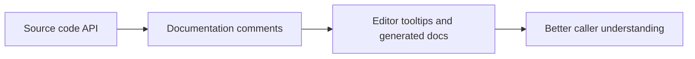

# Documentation Comments

Documentation comments turn source-level intent into structured information that tools can show to other developers. In C#, these comments are usually written with `///` and can appear in IntelliSense, generated documentation, and editor tooltips.

Original Microsoft Learn reference: [Recommended XML tags for C# documentation comments](https://learn.microsoft.com/en-us/dotnet/csharp/language-reference/xmldoc/recommended-tags).

They matter most when an API should be understandable without forcing the reader to open the implementation.

## Why they matter in practice

Good documentation comments help answer questions such as:

- what does this method actually do
- what do these parameters mean
- what does it return
- when can it throw
- how should it be used correctly

This is especially useful for reusable methods, libraries, shared utilities, and public APIs inside a team codebase.

## A basic example

```csharp
/// <summary>
/// Adds two numbers together.
/// </summary>
int Add(int left, int right) => left + right;
```

This is simple, but real documentation comments are most useful when the behavior is not already obvious from the name alone.

## Common XML tags

Some of the most common documentation comment tags are:

- `<summary>` for the main purpose
- `<param>` for parameter descriptions
- `<returns>` for return value meaning
- `<exception>` for documented thrown exceptions
- `<remarks>` for extra guidance or details

## A more practical example

```csharp
/// <summary>
/// Loads application settings from a JSON file.
/// </summary>
/// <param name="filePath">The path to the settings file.</param>
/// <returns>The loaded settings object.</returns>
/// <exception cref="InvalidOperationException">
/// Thrown when the file exists but cannot be parsed into valid settings.
/// </exception>
AppSettings LoadSettings(string filePath)
{
    throw new NotImplementedException();
}
```

This helps a caller understand not only what the method does, but also what assumptions and failure conditions matter.

## A mental model



Documentation comments are mainly for API consumers, not for restating the implementation line by line.

## What good documentation comments describe

The best comments usually explain:

- intent
- expectations
- important rules
- non-obvious behavior
- failure or exceptional conditions

They are less useful when they only repeat the method name in slightly different words.

## When comments add real value

Documentation comments are especially valuable for:

- public methods and types
- reusable libraries
- shared utilities
- methods with important constraints or side effects
- APIs used by other developers who may never read the implementation

## When comments are weak

This kind of comment usually adds little value:

```csharp
/// <summary>
/// Sets the name.
/// </summary>
void SetName(string name)
{
}
```

That mostly repeats what the method name already says.

Better documentation explains what kind of name, what rules apply, and what happens if the input is invalid.

## Common beginner mistakes

- Writing comments that only repeat the method name.
- Documenting every tiny private helper regardless of value.
- Forgetting to mention important exceptions or constraints.
- Treating comments as a substitute for clear naming and clear API design.

## Summary

- documentation comments help tools surface API meaning to callers
- they are usually written with XML-style tags after `///`
- the best comments explain intent, rules, and non-obvious behavior
- they are especially useful for public and reusable APIs
- clear code still matters because comments are not a substitute for good design

## Practice

Write a documentation comment for a method that reads a configuration file and returns parsed settings.

As a second exercise, take one weak summary comment and rewrite it so it explains a real behavioral rule or failure condition.
