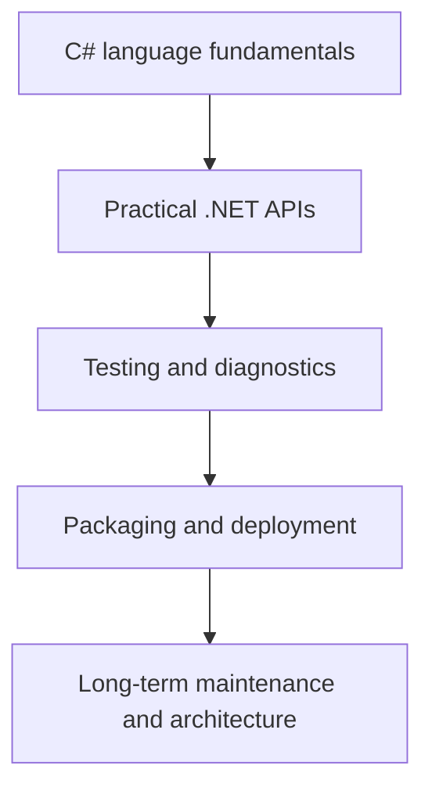

# Next Steps and References

Once the language feels comfortable, the next step is to connect C# to the broader .NET platform. Real software development is not only about syntax. It is about libraries, tooling, runtime behavior, debugging, testing, packaging, deployment, and long-term maintenance.

This chapter closes the practical section by helping you see where C# knowledge leads next.

## What comes after language basics

As you move beyond language learning, practical growth usually expands into areas such as:

- .NET libraries and APIs
- runtime behavior and performance
- debugging and diagnostics
- testing and automation
- project structure and packaging
- deployment and maintenance

## A roadmap view

This is not the only path, but it is a useful practical progression.

## What to deepen next

If you are building momentum after learning core C#, strong next areas include:

- LINQ and data querying
- asynchronous programming
- collections and text handling
- file and network I/O
- testing fundamentals
- object-oriented and API design

These areas appear in real projects constantly.

## Why references matter

Good references help you keep learning without guessing.

In C# and .NET, official documentation is especially valuable because it explains:

- language rules
- library behavior
- supported APIs
- version-specific guidance

That is usually better than relying only on memory or isolated snippets.

## A practical learning approach

The most effective next step is usually not reading everything at once. It is picking one practical area and building with it.

For example:

- build a small console app that reads and writes JSON
- write tests for a small utility library
- use async code with file or HTTP operations
- explore LINQ on realistic collections

This keeps the learning tied to real behavior.

## What to look for in references

Good references usually provide:

- correct syntax and examples
- explanation of constraints and edge cases
- version compatibility notes
- guidance on when a feature is or is not appropriate

That makes official docs, high-quality tutorials, and concrete sample projects valuable companions to experimentation.

## Suggested next study directions

- strengthen .NET library fluency, not only language syntax
- practice reading compiler and runtime errors carefully
- build small projects that combine multiple topics
- learn testing and debugging alongside coding, not only after bugs appear

## Common beginner mistakes

- Thinking language syntax alone is enough to build real applications.
- Reading broadly without building anything concrete.
- Avoiding official documentation because it looks more formal.
- Waiting too long to learn testing, diagnostics, and tooling.

## Summary

- the next step after syntax is practical .NET development
- growth usually includes APIs, testing, diagnostics, packaging, and maintenance
- good references help keep learning accurate and version-aware
- building small realistic programs is one of the best ways to reinforce the language
- practical progress comes from connecting features, not memorizing them in isolation

## Practice

Choose one practical direction such as testing, async I/O, or LINQ, and describe a small project that would help you practice it.

As a second exercise, make a short list of the official reference pages or documentation categories you would keep open while building that project and explain why each one would help.
