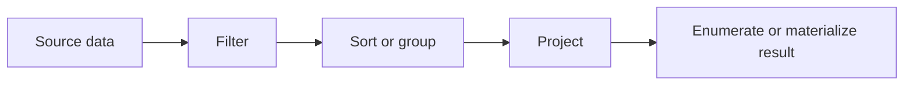

# LINQ Overview

LINQ stands for Language Integrated Query. The name matters because LINQ is not only one helper class or one library call. It is a combination of language syntax, extension methods, delegates, generic interfaces, and library conventions that let C# describe data operations in a consistent way.

Original Microsoft Learn reference: [Introduction to LINQ Queries in C#](https://learn.microsoft.com/en-us/dotnet/csharp/linq/get-started/introduction-to-linq-queries).

Before LINQ, filtering, sorting, grouping, and projecting values were still possible, but the code was often more repetitive. LINQ gives those operations a shared vocabulary that works across arrays, lists, dictionaries, XML, databases, and other data sources.

## Why LINQ matters

LINQ changes how you think about data-oriented code.

- It encourages you to describe what result you want instead of how to build it step by step.
- It makes common data operations readable and composable.
- It helps similar query ideas work across different data sources.
- It reduces boilerplate loops when the intent is filtering, transformation, or aggregation.

That does not mean loops become obsolete. A `foreach` loop is still often clearer when the work is stateful, imperative, or performance-critical. LINQ is strongest when you are expressing a data pipeline.

## A pipeline mental model



Each LINQ operator adds another step. The final result appears when the query is actually used.

## Core LINQ operations

Most LINQ code combines a small set of ideas:

- filtering with `Where`
- projection with `Select`
- ordering with `OrderBy` and `ThenBy`
- aggregation with `Count`, `Sum`, `Max`, and `Aggregate`
- element selection with `First`, `Single`, and `Last`
- grouping with `GroupBy`

```csharp
string[] names = ["Lina", "Omid", "Sara", "Reza"];

IEnumerable<string> shortNames = names
    .Where(name => name.Length <= 4)
    .OrderBy(name => name)
    .Select(name => name.ToUpperInvariant());

foreach (string name in shortNames)
{
    Console.WriteLine(name);
}
```

This pipeline filters, sorts, and transforms the source values. Each step returns another sequence that the next step can build on.

## Why this is different from only thinking in loops

LINQ helps you focus on data intent.

Instead of asking where to place the loop body or when to create a temporary list, you more often ask:

- what values should remain
- in what order should they appear
- what shape should the final result have

That shift in perspective is one of the biggest reasons LINQ matters.

## A useful mental model

An effective beginner mental model is:

- the source sequence provides items
- each LINQ operator builds a new step in the pipeline
- execution often happens only when the result is actually enumerated

That last point is especially important. Many LINQ queries are descriptions of work, not immediate work. The difference between building a query and executing a query affects correctness, performance, and debugging.

## A more practical example

```csharp
var orders = new[]
{
    new { Customer = "Lina", Total = 120m },
    new { Customer = "Omid", Total = 45m },
    new { Customer = "Sara", Total = 200m },
    new { Customer = "Reza", Total = 75m }
};

var premiumCustomers = orders
    .Where(order => order.Total >= 100m)
    .OrderByDescending(order => order.Total)
    .Select(order => order.Customer);

foreach (string customer in premiumCustomers)
{
    Console.WriteLine(customer);
}
```

This feels more like reporting or business logic than a toy list example.

## LINQ is more than in-memory collections

Most learners should begin with arrays and lists because the behavior is easier to see. However, LINQ was designed so the same query style can also work with providers that translate queries into other forms, such as SQL.

That is why this chapter separates `IEnumerable<T>` and `IQueryable<T>`. They look similar at the call site, but they do not always behave the same way under the hood.

## Common beginner mistakes

Do not assume that every LINQ method executes immediately. Do not assume that every query is cheap just because it reads cleanly. Do not assume that `First`, `Single`, or `Last` are interchangeable. Their semantics are different, and the wrong choice can hide bugs.

Another common mistake is using LINQ where the code is mostly side effects rather than querying. If the main work is updating state, writing output, or coordinating complex actions, a loop is often clearer.

## Summary

- LINQ provides a shared query vocabulary for many data sources
- it expresses data pipelines through composable operators
- it is strongest when the code is really about querying or shaping data
- many LINQ operations are deferred until enumeration
- understanding LINQ well starts with understanding both intent and execution behavior

## Practice

Take a loop that filters and transforms a list into another list. Rewrite it with `Where` and `Select`, then explain which version is easier to read and why.

As a second exercise, take a query that filters and sorts data, and identify which part is filtering, which part is ordering, and which part is projection.
