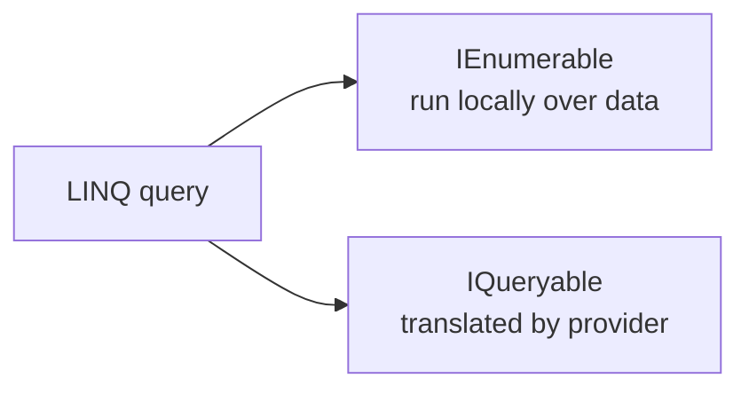

# IQueryable, Expression Trees, and Providers

At first glance, `IEnumerable<T>` and `IQueryable<T>` can look almost identical. Both support LINQ operators. Both let you write query pipelines. The difference is in what those pipelines mean.

This topic matters because the same query shape can behave very differently depending on whether the data is already in memory or whether a provider must translate the query into something else, such as SQL.

## `IEnumerable<T>` versus `IQueryable<T>`

`IEnumerable<T>` is for in-memory enumeration. LINQ operators usually receive delegates and execute them directly against local data.

`IQueryable<T>` represents a query that can be translated by a provider. Instead of executing your lambda bodies directly, the provider inspects the query structure and converts it into another form, often SQL.

That means the same-looking query can have very different execution behavior.



## Expression trees

An expression tree is a data structure that represents code as data. Instead of only saying, "run this lambda," an expression tree can say, "here is the structure of the lambda so another component can inspect it."

That is what makes remote query providers possible. A provider can examine an expression tree and translate it into a backend-specific query language.

This is the key reason `IQueryable<T>` is more than just another collection interface. It represents a query description that a provider can inspect.

## Why providers matter

When a query is handled by a provider, not every .NET operation is translatable. A provider may understand comparisons, projections, and some method calls, but it may reject custom logic that only makes sense in local memory.

```csharp
IQueryable<Customer> customers = dbContext.Customers;

var activeCustomers = customers
    .Where(customer => customer.IsActive)
    .OrderBy(customer => customer.LastName)
    .Select(customer => new
    {
        customer.Id,
        customer.LastName
    });
```

This style is usually translatable because the operations are simple and provider-friendly.

By contrast, a query that calls arbitrary local helper methods may fail translation or force client-side evaluation, depending on the provider.

## Why provider-friendly code matters

With provider-translated queries, not every C# expression can be turned into an equivalent remote query.

For example, this kind of helper may be risky:

```csharp
bool IsPreferred(Customer customer) => customer.IsActive && customer.LastName.Length > 3;
```

Using that helper inside an `IQueryable<T>` query may or may not be translatable depending on the provider and the exact expression.

That is why provider-oriented query code often sticks to simpler, more obviously translatable expressions.

## Performance consequences

With `IQueryable<T>`, query shape affects what work runs remotely and what data must cross process or network boundaries. That makes correctness and performance tightly connected.

Important questions include:

- does the filter run on the server or after the data is loaded
- are you selecting only the fields you need
- are you materializing too early with `ToList()`
- are you accidentally composing a query that the provider cannot translate

## Materialization changes the mode

Once you materialize an `IQueryable<T>` query with something like `ToList()`, the later work happens in memory over local data.

That means query boundaries matter.

```csharp
var customers = dbContext.Customers
    .Where(customer => customer.IsActive)
    .ToList();

var localResult = customers
    .Where(customer => customer.LastName.Length > 3)
    .Select(customer => customer.LastName);
```

The first `Where` is provider-translated. The later `Where` is ordinary LINQ to Objects because the data has already been loaded.

## A practical rule

Use `IEnumerable<T>` when the data is already local and you want normal in-memory LINQ behavior. Use `IQueryable<T>` when you are intentionally composing a provider-translated query and understand the provider's limitations.

## Common beginner mistakes

- Assuming `IQueryable<T>` behaves exactly like `IEnumerable<T>`.
- Forgetting that providers may not translate arbitrary local logic.
- Materializing too early and then losing efficient remote filtering.
- Forgetting that query shape directly affects performance and data transfer.

## Summary

- `IEnumerable<T>` is for in-memory LINQ execution
- `IQueryable<T>` represents queries that providers can translate
- expression trees let providers inspect query structure instead of only running local delegates
- provider-translated queries must stay within what the provider can understand
- materialization marks an important boundary between remote querying and local processing

## Practice

Take one query written for a list and ask which parts would still make sense if the source were remote. Identify any helper methods or operations that would be risky to depend on in a provider-translated query.

As a second exercise, sketch one query and mark where remote provider execution ends and local in-memory processing begins after a call to `ToList()`.
