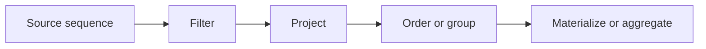
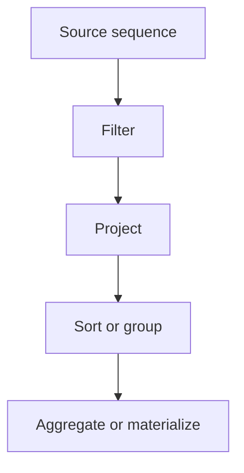

# LINQ Operators Overview

LINQ feels much easier once you stop seeing it as a bag of unrelated methods and start seeing operator families. Most real queries are built by combining a small number of recurring ideas: filter some data, project it into a different shape, order it, group it, and finally materialize or aggregate it.

Original Microsoft Learn reference: [Standard query operators overview](https://learn.microsoft.com/en-us/dotnet/csharp/linq/standard-query-operators/).

## A practical mental model



Not every query uses all of those stages, but many do.

## Filtering operators

Filtering keeps only the elements that match a condition.

- `Where`
- `OfType<T>`
- `Skip`, `Take`, `SkipWhile`, `TakeWhile`

```csharp
int[] numbers = [1, 2, 3, 4, 5, 6];

IEnumerable<int> evenNumbers = numbers.Where(number => number % 2 == 0);
```

Filtering is often the first step because it reduces the amount of data the later operators need to process.

## Projection operators

Projection transforms each element into a new value or shape.

- `Select`
- `SelectMany`

```csharp
var names = products.Select(product => product.Name);
```

`Select` maps one element to one output element. `SelectMany` flattens nested sequences.

```csharp
var allTags = posts.SelectMany(post => post.Tags);
```

## Ordering operators

Ordering rearranges a sequence.

- `OrderBy`
- `OrderByDescending`
- `ThenBy`
- `ThenByDescending`
- `Reverse`

```csharp
var sorted = products
    .OrderBy(product => product.Category)
    .ThenBy(product => product.Name);
```

The key lesson is that `OrderBy` starts an ordering, while `ThenBy` refines an existing one.

## Grouping operators

Grouping partitions a sequence into buckets based on a key.

- `GroupBy`
- `ToLookup`

```csharp
var grouped = products.GroupBy(product => product.Category);

foreach (var group in grouped)
{
    Console.WriteLine(group.Key);
}
```

`GroupBy` is deferred, while `ToLookup` builds an immediate lookup structure.

## Joining operators

Joining combines elements from two sequences based on matching keys.

- `Join`
- `GroupJoin`
- query-expression `join`

```csharp
var orderSummaries = orders.Join(
    customers,
    order => order.CustomerId,
    customer => customer.Id,
    (order, customer) => new { order.Id, CustomerName = customer.Name });
```

Joins are one of the clearest examples of why LINQ is more than filtering. It can express relationships across collections.

## Set operators

Set operators compare or combine sequences as sets.

- `Distinct`
- `Union`
- `Intersect`
- `Except`

```csharp
string[] localTags = ["csharp", "dotnet", "linq"];
string[] remoteTags = ["linq", "xml", "json"];

var mergedTags = localTags.Union(remoteTags);
```

These operators often depend on equality semantics. If you are working with custom types, you may need a custom comparer.

## Element operators

Element operators return one element or a small bounded subset.

- `First`, `FirstOrDefault`
- `Single`, `SingleOrDefault`
- `Last`, `LastOrDefault`
- `ElementAt`, `ElementAtOrDefault`

Use these carefully because their behavior expresses assumptions.

- `First` means you expect at least one match
- `Single` means you expect exactly one match

If that assumption is wrong, the method throws.

## Aggregation operators

Aggregation reduces many elements to one answer.

- `Count`
- `Any`, `All`
- `Sum`, `Average`, `Min`, `Max`
- `Aggregate`

```csharp
decimal total = items.Sum(item => item.Price * item.Quantity);
```

Use `Aggregate` when the built-in aggregations do not fit, but avoid it when a clearer operator already exists.

## Generation and conversion operators

Generation creates sequences:

- `Range`
- `Repeat`
- `Empty<T>`

Conversion materializes or changes sequence shape:

- `ToList`
- `ToArray`
- `ToDictionary`
- `ToHashSet`
- `Cast<T>`

```csharp
IEnumerable<int> ids = Enumerable.Range(1, 5);
List<int> list = ids.ToList();
```

## Deferred versus immediate behavior

Operator families also differ by execution behavior.

Usually deferred:

- `Where`
- `Select`
- `OrderBy`
- `GroupBy`

Usually immediate:

- `ToList`
- `Count`
- `First`
- `Sum`

That distinction matters because it affects performance, source mutation visibility, and multiple enumeration.

## A worked example

```csharp
var results = students
    .Where(student => student.IsActive)
    .OrderBy(student => student.LastName)
    .ThenBy(student => student.FirstName)
    .Select(student => new
    {
        FullName = $"{student.FirstName} {student.LastName}",
        student.Email
    })
    .ToList();
```

This one query shows several operator families working together:

- `Where` filters
- `OrderBy` and `ThenBy` sort
- `Select` projects
- `ToList` materializes

## Practical guidance

- Learn operators by family instead of memorizing them alphabetically.
- Choose the operator that matches your intent precisely.
- Be careful with element operators that throw when assumptions are violated.
- Remember that materialization changes both timing and memory behavior.

## Summary

- LINQ operators fall into repeatable families such as filtering, projection, grouping, joining, and aggregation
- understanding those families makes real queries easier to design and debug
- deferred and immediate execution are just as important as operator names
- most production queries combine a few operator families rather than using one in isolation

## Practice

Take a list of orders and write one query that filters open orders, sorts by creation date, projects a summary object, and materializes the result.

As a second exercise, rewrite a query that uses `Aggregate` into one that uses a more specific operator if possible, then explain why the second version is clearer.

- sort or group data
- answer a question about a sequence
- materialize or aggregate results



That flow is not mandatory, but it matches how many real queries are built.

## Filtering operators

Filtering keeps some elements and removes others.

- `Where`
- `OfType<T>`
- `Skip`
- `Take`
- `SkipWhile`
- `TakeWhile`

```csharp
int[] numbers = [1, 2, 3, 4, 5, 6];

IEnumerable<int> evenNumbers = numbers.Where(number => number % 2 == 0);
```

Filtering is usually the first step because it reduces the data before more expensive work happens.

## Projection operators

Projection transforms each element into another form.

- `Select`
- `SelectMany`

```csharp
var people = new[]
{
    new { Name = "Ava", Age = 29 },
    new { Name = "Omid", Age = 34 }
};

var names = people.Select(person => person.Name);
```

Projection is one of the most important LINQ ideas because it lets you shape data for the next step instead of carrying unnecessary fields through the whole query.

`SelectMany` is the flattening operator. It turns many inner sequences into one outer sequence.

## Ordering operators

Ordering changes sequence order.

- `OrderBy`
- `OrderByDescending`
- `ThenBy`
- `ThenByDescending`
- `Reverse`

```csharp
var ordered = people
    .OrderBy(person => person.Age)
    .ThenBy(person => person.Name);
```

Remember that ordering is usually deferred, just like most other LINQ operators.

## Grouping operators

Grouping collects elements under keys.

- `GroupBy`
- `ToLookup`

```csharp
var grouped = people.GroupBy(person => person.Age >= 30 ? "30+" : "Under 30");
```

`GroupBy` is deferred. `ToLookup` materializes a lookup structure immediately.

That difference matters when you want either a reusable index or a still-composable query.

## Joining operators

Joining combines data from more than one sequence.

- `Join`
- `GroupJoin`
- `Zip`

```csharp
var departments = new[]
{
    new { Id = 1, Name = "Engineering" },
    new { Id = 2, Name = "Sales" }
};

var employees = new[]
{
    new { Name = "Mina", DepartmentId = 1 },
    new { Name = "Saeed", DepartmentId = 2 }
};

var result = employees.Join(
    departments,
    employee => employee.DepartmentId,
    department => department.Id,
    (employee, department) => new { employee.Name, Department = department.Name });
```

Joins are powerful, but they can become hard to read if the projection grows too complex. When that happens, break the work into smaller named steps.

## Set operators

Set-style operators treat sequences more like mathematical sets.

- `Distinct`
- `Union`
- `Intersect`
- `Except`

```csharp
string[] left = ["A", "B", "C"];
string[] right = ["B", "C", "D"];

var onlyLeft = left.Except(right);
var common = left.Intersect(right);
var combined = left.Union(right);
```

These operators often depend on equality rules, which means custom comparers may matter.

## Element operators

Element operators return one element rather than a full sequence.

- `First`
- `FirstOrDefault`
- `Single`
- `SingleOrDefault`
- `Last`
- `ElementAt`

Choose carefully:

- `First` means at least one match is expected
- `Single` means exactly one match is expected
- the `OrDefault` forms allow absence

Those are not interchangeable. Each one expresses a different business assumption.

## Quantifiers and aggregation

Some operators answer yes-or-no questions or reduce a sequence to one final result.

- `Any`
- `All`
- `Contains`
- `Count`
- `Sum`
- `Min`
- `Max`
- `Average`
- `Aggregate`

```csharp
bool hasAdults = people.Any(person => person.Age >= 18);
```

These operators execute immediately because they need a final answer.

## Conversion and materialization

Some operators turn a query into a concrete result structure.

- `ToList`
- `ToArray`
- `ToDictionary`
- `ToHashSet`

Materialization is how you capture a stable snapshot.

```csharp
List<string> nameList = names.ToList();
```

## A worked example

```csharp
var orders = new[]
{
    new { Customer = "Ava", Total = 120m, IsPaid = true },
    new { Customer = "Ava", Total = 80m, IsPaid = false },
    new { Customer = "Noah", Total = 220m, IsPaid = true }
};

var summaries = orders
    .Where(order => order.IsPaid)
    .GroupBy(order => order.Customer)
    .Select(group => new
    {
        Customer = group.Key,
        TotalPaid = group.Sum(order => order.Total)
    })
    .OrderByDescending(summary => summary.TotalPaid)
    .ToList();
```

This one query demonstrates filtering, grouping, projection, ordering, aggregation, and materialization in a readable pipeline.

## Common mistakes

- Using `Single` when the data is not guaranteed to contain exactly one element.
- Adding side effects inside `Where` or `Select` lambdas.
- Materializing too early and losing the benefits of composition.
- Leaving queries deferred when repeated enumeration or source mutation will be confusing.

## Practical guidance

- Learn operators by category rather than as an unconnected list.
- Let the choice between `First`, `Single`, `Any`, and `Count` express your real expectation.
- Prefer readable pipelines over compressed cleverness.
- Materialize deliberately when you need a stable snapshot or repeated access.

## Summary

- LINQ operators fall into a small number of recurring categories
- filtering, projection, grouping, joining, ordering, and aggregation cover most real queries
- element and quantifier operators express important assumptions about the data
- materialization changes a query from deferred to concrete
- category-based thinking makes LINQ much easier to learn and use well

## Practice

Take a small list of objects and write one query that filters, groups, and projects the data into a summary shape.

As a second exercise, compare `First`, `FirstOrDefault`, `Single`, and `SingleOrDefault` by describing what each one assumes about the sequence.
