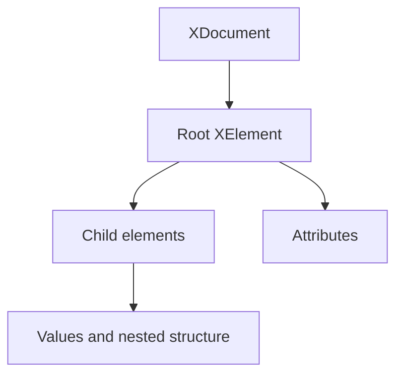
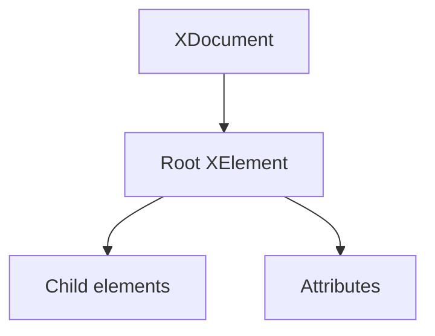

# LINQ to XML

LINQ to XML is the .NET XML API built around `XDocument`, `XElement`, and LINQ queries. It gives you an in-memory XML object model that feels much closer to normal C# than older cursor-style XML APIs.

Original Microsoft Learn reference: [LINQ to XML overview](https://learn.microsoft.com/en-us/dotnet/standard/linq/linq-xml-overview).

## Why this topic matters

XML is no longer the default format for every application, but it still appears in configuration, build systems, office formats, service integrations, documentation, and many older enterprise systems. LINQ to XML is one of the cleanest ways to work with it from C#.

## The core object model

The main types are:

- `XDocument` for a full document
- `XElement` for an element node
- `XAttribute` for attributes
- `XName` for element and attribute names



## Creating XML in code

```csharp
using System.Xml.Linq;

XDocument document = new(
    new XElement("books",
        new XElement("book",
            new XAttribute("id", 1),
            new XElement("title", "C# in Depth"),
            new XElement("author", "Jon Skeet"))));

Console.WriteLine(document);
```

This style is one reason LINQ to XML is popular. The XML shape is visible directly in the C# code.

## Reading and navigating XML

```csharp
XElement root = document.Root!;

foreach (XElement book in root.Elements("book"))
{
    string? title = (string?)book.Element("title");
    Console.WriteLine(title);
}
```

The cast syntax is important here. LINQ to XML often uses explicit casts for extracting typed values from elements and attributes.

## Querying with LINQ

```csharp
var titles = document
    .Descendants("book")
    .Where(book => (int?)book.Attribute("id") >= 1)
    .Select(book => (string?)book.Element("title"));
```

This is where the name comes from: you are using normal LINQ operators over an XML object graph.

## Updating an XML tree

Because the document is in memory, you can modify it like any other object graph.

```csharp
XElement newBook = new(
    "book",
    new XAttribute("id", 2),
    new XElement("title", "Pro .NET Memory Management"),
    new XElement("author", "Konrad Kokosa"));

document.Root!.Add(newBook);
```

You can also change values, remove nodes, replace nodes, or add attributes.

## Working with values safely

LINQ to XML extraction often uses casts such as `(string?)`, `(int?)`, or `(DateTime?)`. That is convenient, but you should still think about missing data and invalid shape.

```csharp
int? id = (int?)newBook.Attribute("id");
string? author = (string?)newBook.Element("author");
```

If the XML is controlled by external input, validate assumptions instead of trusting the structure blindly.

## Namespaces matter

XML namespaces are part of element identity. If an XML document uses namespaces, querying by local name alone will not always work.

```csharp
XNamespace ns = "https://example.com/catalog";

XElement rootWithNamespace = new(
    ns + "catalog",
    new XElement(ns + "book", new XElement(ns + "title", "Networking in .NET")));
```

When querying, you must use the same namespace-aware names.

```csharp
var namespacedTitles = rootWithNamespace
    .Elements(ns + "book")
    .Select(book => (string?)book.Element(ns + "title"));
```

## Saving and loading documents

```csharp
document.Save("books.xml");

XDocument loaded = XDocument.Load("books.xml");
```

That makes LINQ to XML useful both for generated XML and for XML that comes from files, APIs, or legacy systems.

## LINQ to XML versus `XmlReader`

LINQ to XML is convenient and expressive because it builds a full in-memory tree. `XmlReader` is lower-level and streaming-based. That usually means:

- LINQ to XML is easier for querying and updating document structure
- `XmlReader` is better when documents are huge and streaming matters more than convenience

You do not choose one because it is newer and the other because it is older. You choose based on the processing model you need.

## Practical guidance

- Use LINQ to XML when you want an in-memory XML tree that is easy to query and edit.
- Be explicit about namespaces; they are part of the XML shape, not optional decoration.
- Use casts carefully when reading values from external XML.
- Switch to streaming APIs when the document is too large for comfortable in-memory processing.

## Summary

- LINQ to XML provides an in-memory XML object model built for C#
- `XDocument` and `XElement` are the central types
- you can create, query, update, save, and load XML by using normal object and LINQ patterns
- namespaces and value extraction are the two most common sources of confusion

## Practice

Create an `XDocument` that stores a small catalog of courses, then query only the course titles.

As a second exercise, add a namespace to the document and update the query so it still works correctly.



The important shift is that XML becomes an object graph you can query with ordinary C# and LINQ instead of manual cursor-style traversal.

## Creating XML in memory

```csharp
using System.Xml.Linq;

XDocument document = new(
    new XElement("students",
        new XElement("student",
            new XAttribute("id", 1),
            new XElement("name", "Ava"),
            new XElement("score", 91)),
        new XElement("student",
            new XAttribute("id", 2),
            new XElement("name", "Noah"),
            new XElement("score", 84))));
```

This constructor-based style is one reason LINQ to XML is popular. The creation code looks structurally similar to the XML it represents.

## Querying XML with LINQ

```csharp
var highScores = document
    .Root!
    .Elements("student")
    .Where(student => (int)student.Element("score")! >= 90)
    .Select(student => (string)student.Element("name")!);
```

This is one of the main benefits of LINQ to XML: XML data can participate in the same query style you already use for collections.

## Reading attributes and element values

```csharp
foreach (XElement student in document.Root!.Elements("student"))
{
    int id = (int)student.Attribute("id")!;
    string name = (string)student.Element("name")!;
    int score = (int)student.Element("score")!;

    Console.WriteLine($"{id}: {name} -> {score}");
}
```

Explicit casts are common in LINQ to XML. They provide a convenient way to read strongly typed values from XML nodes.

## Updating the document

Because the document is in memory, modifications are straightforward.

```csharp
XElement newStudent = new(
    "student",
    new XAttribute("id", 3),
    new XElement("name", "Mia"),
    new XElement("score", 95));

document.Root!.Add(newStudent);
```

You can also change values or remove nodes.

```csharp
document.Root!
    .Elements("student")
    .First(student => (int)student.Attribute("id")! == 2)
    .Element("score")!
    .Value = "88";
```

## Namespaces matter in XML

If XML uses namespaces, you usually need `XNamespace` to query correctly.

```csharp
XNamespace ns = "http://example.com/school";

XElement root = new(ns + "students",
    new XElement(ns + "student",
        new XElement(ns + "name", "Ava")));
```

Queries must use the same namespace-qualified names. This is one of the most common sources of confusion when a query seems correct but returns nothing.

## Saving XML

```csharp
document.Save("students.xml");
```

You can also save to a stream or writer, which becomes useful when XML participates in a larger I/O pipeline.

## A practical example

```csharp
using System.Xml.Linq;

XDocument catalog = new(
    new XElement("books",
        new XElement("book",
            new XAttribute("isbn", "978-1"),
            new XElement("title", "C# Basics"),
            new XElement("price", 30m)),
        new XElement("book",
            new XAttribute("isbn", "978-2"),
            new XElement("title", "LINQ in Practice"),
            new XElement("price", 45m))));

var expensiveBooks = catalog.Root!
    .Elements("book")
    .Where(book => (decimal)book.Element("price")! >= 40m)
    .Select(book => new
    {
        Isbn = (string)book.Attribute("isbn")!,
        Title = (string)book.Element("title")!
    });
```

This feels much closer to normal collection work than traditional DOM programming.

## LINQ to XML versus `XmlReader`

LINQ to XML loads an in-memory tree and is best when:

- the XML is moderate in size
- readability matters
- you need random access or updates
- query composition is useful

`XmlReader` is better when:

- the XML is large
- forward-only streaming is enough
- memory usage must stay low

That tradeoff is the key architectural choice.

## Common mistakes

- Forgetting that namespaces are part of the element name.
- Using `.Element(...)` where multiple child elements exist and `.Elements(...)` is needed.
- Assuming XML values are already typed without conversion.
- Loading huge XML documents into memory when a streaming reader would be better.

## Practical guidance

- Choose LINQ to XML when readability and queryability matter more than low-level streaming efficiency.
- Treat namespaces carefully and explicitly.
- Use object projection to move from XML nodes into domain-friendly shapes.
- Reach for `XmlReader` when document size or streaming requirements dominate the design.

## Summary

- LINQ to XML turns XML into an in-memory object graph built from `XDocument` and `XElement`
- you can create, query, update, and save XML with normal C# and LINQ patterns
- namespaces are a common but important source of query mistakes
- explicit casts make it easy to pull typed values from XML nodes
- LINQ to XML is ideal for readable XML manipulation on data that fits comfortably in memory

## Practice

Create an `XDocument` that stores a small product catalog, then query the products above a chosen price.

As a second exercise, add an XML namespace to the document and update the query so it still works correctly.
