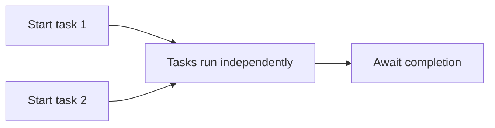

# Starting and Coordinating Tasks

One of the biggest practical async lessons is that the placement of `await` changes program behavior. If two pieces of work are independent, you can often start both tasks first and await them later. If you await each one immediately, you may accidentally serialize work that could have overlapped.

Original Microsoft Learn reference: [Microsoft Learn asynchronous programming in C#](https://learn.microsoft.com/dotnet/csharp/asynchronous-programming/).

## A coordination mental model



This is one of the most practical async ideas: starting tasks and awaiting tasks are related, but they are not always the same moment.

## Sequential versus coordinated work

This version runs sequentially:

```csharp
string profile = await GetProfileAsync();
string orders = await GetOrdersAsync();
```

If `GetProfileAsync` and `GetOrdersAsync` are independent, you can start both first:

```csharp
Task<string> profileTask = GetProfileAsync();
Task<string> ordersTask = GetOrdersAsync();

string profile = await profileTask;
string orders = await ordersTask;
```

The second version still awaits both results, but it gives both operations a chance to begin before the first wait completes.

## Why this matters

If two operations do not depend on each other, awaiting the first before starting the second can waste time.

That is why task coordination is really about dependency analysis:

- which steps truly depend on earlier results
- which steps can overlap safely

## `Task.WhenAll`

`Task.WhenAll` is useful when you want to wait for all tasks in a group to finish.

```csharp
Task<string> profileTask = GetProfileAsync();
Task<string> ordersTask = GetOrdersAsync();

await Task.WhenAll(profileTask, ordersTask);

Console.WriteLine(profileTask.Result);
Console.WriteLine(ordersTask.Result);
```

After `Task.WhenAll` completes successfully, the individual tasks are already complete, so reading their results is safe.

`Task.WhenAll` is a strong fit when you care about all results and all operations can run independently.

## `Task.WhenAny`

`Task.WhenAny` is useful when you want to react to whichever task finishes first. This can support timeout logic, fastest-response wins patterns, or staged fallback behavior.

It is especially useful when not every task must win. Sometimes you only need the first successful or first completed result.

## Coordinating tasks intentionally

When you keep task references in variables, the code becomes explicit about what started, what is still running, and what you are waiting on. That is often easier to reason about than deeply nested awaits.

At the same time, do not start background tasks casually and forget them. Unobserved failures and unclear lifetime management create fragile code.

## A more practical example

```csharp
Task<string> profileTask = GetProfileAsync();
Task<string> ordersTask = GetOrdersAsync();
Task<string> notificationsTask = GetNotificationsAsync();

await Task.WhenAll(profileTask, ordersTask, notificationsTask);

Console.WriteLine(profileTask.Result);
Console.WriteLine(ordersTask.Result);
Console.WriteLine(notificationsTask.Result);
```

This kind of pattern is common in dashboards, page assembly, and multi-source data loading.

## Common mistakes

The classic mistake is accidental serialization: starting one async operation, awaiting it immediately, then starting the next operation even though they were independent.

Another mistake is starting too many operations at once without understanding resource limits. Concurrency can improve throughput, but unbounded concurrency can overwhelm APIs, sockets, databases, or memory.

## Practical guidance

Good task coordination usually means:

- identify real dependencies before adding concurrency
- start independent tasks earlier when that improves latency
- use `Task.WhenAll` for all-results coordination
- use `Task.WhenAny` when first-complete behavior matters
- respect resource limits instead of assuming more concurrency is always better

## Summary

- where you place `await` changes behavior
- independent work can often be started first and awaited later
- `Task.WhenAll` waits for a group of tasks
- `Task.WhenAny` identifies the first completed task
- coordination should be based on actual dependencies and resource limits

## Practice

Look at an async workflow that makes several remote calls. Identify which steps depend on earlier results and which could safely start in parallel.

As a second exercise, write one small example that first runs two independent tasks sequentially and then rewrites the same workflow to coordinate them more efficiently.
