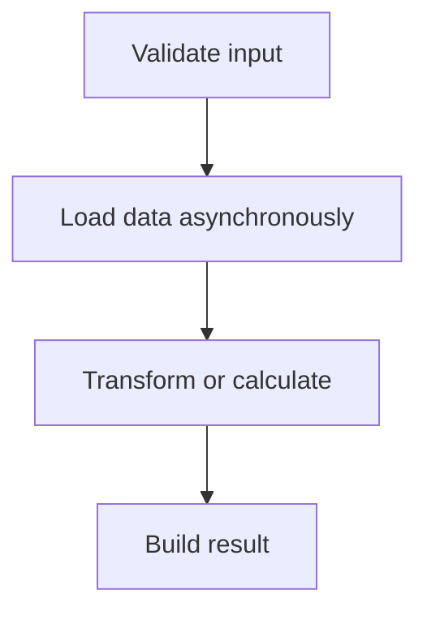

# Composing Async Workflows

Real async code is usually more than one awaited call. A useful application often combines validation, data retrieval, transformation, error handling, logging, cancellation, and result construction into one larger workflow.

Original Microsoft Learn reference: [Microsoft Learn asynchronous programming in C#](https://learn.microsoft.com/dotnet/csharp/asynchronous-programming/).

The goal is not just to make the code asynchronous. The goal is to keep the flow understandable as the workflow grows.

## Why composition matters

Real async code becomes difficult quickly when too many concerns are mixed into one method. Composition helps by breaking the workflow into steps with clear responsibilities.



That flow is easier to explain, test, and maintain than one long method doing everything inline.

## Compose small async methods

Async workflows become easier to maintain when each method does one clear job and returns a task that represents that job.

```csharp
public static async Task<OrderSummary> BuildOrderSummaryAsync(int orderId)
{
    Order order = await GetOrderAsync(orderId);
    Customer customer = await GetCustomerAsync(order.CustomerId);
    decimal total = CalculateTotal(order);

    return new OrderSummary(order.Id, customer.Name, total);
}
```

This method composes async steps with a synchronous calculation step. That is normal. Async methods do not need every line to be asynchronous.

That point is important. Async code is usually a mixture of:

- awaited I/O steps
- synchronous validation
- synchronous transformations or calculations
- error-handling or logging steps

## Keep naming honest

In .NET, async methods are usually named with the `Async` suffix. That convention matters because it helps readers understand what kind of method they are calling and what return type to expect.

Examples:

- `LoadSettingsAsync`
- `ReadFileAsync`
- `SendEmailAsync`

If a method returns `Task` or `Task<T>`, the `Async` suffix usually improves clarity.

This naming rule matters more than it might first appear. Async APIs become much easier to scan when the method names make their behavior obvious.

## Control flow still matters

`await` makes async workflows readable, but it does not remove the need for good structure. If a method becomes hard to scan, extract meaningful helpers instead of leaving one long chain of awaited steps in a single method.

That also makes testing easier because each step can be validated in isolation.

## Cancellation belongs in the method design

Many real async methods should accept a `CancellationToken`, especially if they perform I/O, long-running work, or user-triggered operations.

```csharp
public static async Task<string> LoadTextAsync(string filePath, CancellationToken cancellationToken)
{
    using var stream = File.OpenRead(filePath);
    using var reader = new StreamReader(stream);
    return await reader.ReadToEndAsync(cancellationToken);
}
```

Cancellation is easier to include early than to retrofit later across many call sites.

## A practical workflow example

```csharp
public static async Task<OrderSummary> BuildOrderSummaryAsync(int orderId)
{
    ValidateOrderId(orderId);

    Order order = await GetOrderAsync(orderId);
    Customer customer = await GetCustomerAsync(order.CustomerId);
    decimal total = CalculateTotal(order);

    return new OrderSummary(order.Id, customer.Name, total);
}
```

This example stays readable because each step has a clear role.

## Common mistakes

Do not create long async methods that mix validation, networking, parsing, logging, and mutation with no clear structure. If you cannot explain the steps in one sentence each, the method probably needs smaller pieces.

## Summary

- async workflows usually combine several kinds of steps, not only awaited calls
- small focused methods make async code easier to maintain
- the `Async` suffix improves API clarity
- cancellation should be part of the design for many real async operations
- readable structure matters just as much in async code as in synchronous code

## Practice

Take one async workflow and split it into named helper methods. Make sure each helper's name explains its role in the larger operation.

As a second exercise, review one long async method and identify where validation, I/O, transformation, and result-building should be separated into clearer steps.
