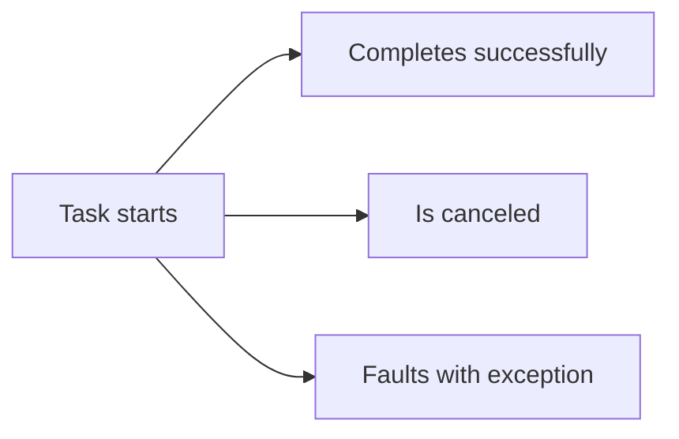

# Async Exceptions and Task Composition

Asynchronous code does not remove failures. It changes where and when you observe them. A task can complete successfully, be canceled, or fault with an exception. Understanding that lifecycle is essential for writing reliable async code.

Original Microsoft Learn reference: [Microsoft Learn asynchronous programming in C#](https://learn.microsoft.com/dotnet/csharp/asynchronous-programming/).

## A task lifecycle mental model



This matters because the task object represents the outcome, and the outcome may not be visible until you await or inspect it.

## Faulted tasks

When an exception happens inside an async method, the task becomes faulted. The exception is stored on the task and rethrown when the task is awaited.

```csharp
try
{
    await ProcessOrderAsync();
}
catch (InvalidOperationException ex)
{
    Console.WriteLine(ex.Message);
}
```

This feels natural because `await` rethrows the failure in a way that works with normal `try` and `catch` logic.

That is one of the great strengths of `await`: exception handling stays close to the ordinary synchronous model.

## `Task.WhenAll` and failures

`Task.WhenAll` completes successfully only if every task completes successfully. If one or more tasks fail, the combined operation fails.

That behavior is useful because it prevents you from quietly ignoring part of a coordinated workflow.

When debugging a failure in `WhenAll`, it is often useful to inspect the individual tasks too, especially if several operations may have failed.

## `Task.WhenAny` and follow-up logic

`Task.WhenAny` only tells you which task completed first. It does not automatically mean that the winning task succeeded. You still need to inspect or await the returned task to observe success, cancellation, or failure correctly.

That is a common source of confusion. First-complete is not the same as first-successful.

## Prefer `await` over continuation-heavy code

Older task code often used `ContinueWith`. That style still exists, but `await` is usually clearer because it preserves normal control flow and exception handling.

In most application code, if you are choosing between `await` and manually chained continuations, `await` is the better default.

## Fire-and-forget needs caution

Sometimes code starts a task and does not await it. That may be intentional in carefully designed background work, but it is risky when done casually.

If the task faults and nobody observes the exception, diagnosing the problem becomes much harder.

That is why fire-and-forget should never be casual default behavior.

## Common mistakes

Do not forget to observe task failures. Fire-and-forget task code can hide exceptions unless you have a deliberate strategy for background work, logging, and lifetime management.

Do not assume `WhenAny` means success. Do not assume `WhenAll` reports only one failure in a meaningful way for diagnosis. When debugging, inspect the individual tasks as well.

## Practical guidance

Reliable async code usually means:

- await tasks whose outcome matters
- catch and handle expected failures at the right boundary
- remember that `WhenAny` only reports completion order
- inspect grouped tasks carefully when coordinated work fails
- avoid casual fire-and-forget behavior

## Summary

- async code still fails, but failures are observed through tasks
- awaiting a faulted task rethrows its exception
- `Task.WhenAll` fails if any coordinated task fails
- `Task.WhenAny` tells you which task finished first, not whether it succeeded
- careful observation of task outcomes is essential for reliable async code

## Practice

Write a small example with two tasks where one succeeds and one throws. Observe what happens when you await each task individually and when you coordinate them with `Task.WhenAll`.

As a second exercise, explain why a fire-and-forget task can make production failures harder to diagnose than an awaited task with normal exception handling.
