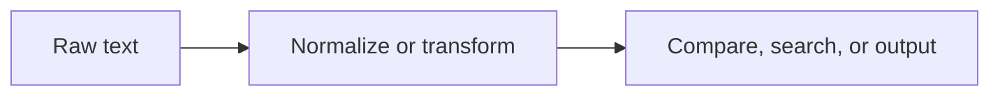

# Strings and Text Processing

Strings appear everywhere: user input, file paths, logs, commands, JSON payloads, URLs, identifiers, and messages shown to users. That is why string handling deserves a practical guide instead of being treated as a small syntax topic.

Original Microsoft Learn reference: [Microsoft Learn C# how-to guides](https://learn.microsoft.com/dotnet/csharp/how-to/).

## A practical mental model

Text handling usually involves three different concerns:

- representation: what text do you currently have
- transformation: how should it be cleaned, split, joined, or formatted
- comparison: how should equality or matching be interpreted



## Remember that strings are immutable

In C#, a string cannot be changed in place. Operations that seem to modify a string actually create a new string.

```csharp
string original = "learn csharp";
string upper = original.ToUpperInvariant();

Console.WriteLine(original);
Console.WriteLine(upper);
```

This matters for correctness and performance. If you repeatedly build large strings in a loop, `StringBuilder` may be a better fit.

For small ordinary transformations, regular string methods are often perfectly fine. `StringBuilder` becomes more useful when repeated concatenation would create many intermediate strings.

## Common text operations

Everyday string work usually involves:

- checking contents with `Contains`, `StartsWith`, and `EndsWith`
- splitting with `Split`
- joining with `string.Join`
- trimming with `Trim`, `TrimStart`, and `TrimEnd`
- replacing text with `Replace`
- formatting values into output strings

```csharp
string csv = "Ada,Grace,Lina";
string[] names = csv.Split(',');

foreach (string name in names)
{
    Console.WriteLine(name.Trim());
}
```

This example shows a common pattern:

- receive one raw string
- split it into pieces
- clean each piece before using it

## Compare strings deliberately

String comparison is one of the most common sources of subtle bugs. Decide whether the comparison should be culture-sensitive or ordinal, and whether casing should matter.

```csharp
bool isMatch = fileName.Equals(
    "report.txt",
    StringComparison.OrdinalIgnoreCase);
```

For identifiers, keys, protocol values, and many technical comparisons, `StringComparison.Ordinal` or `StringComparison.OrdinalIgnoreCase` is usually the safest default.

That explicit comparison choice is one of the most important habits in practical C# string work.

## Culture matters

Human-facing text can behave differently under different cultures. Sorting, casing, and formatting rules are not always universal. That is why text intended for display and text intended for technical comparison should not always be handled the same way.

## A more complete example

```csharp
string input = "  Ada, grace , LINA  ";

string[] normalizedNames = input
    .Split(',')
    .Select(name => name.Trim())
    .Where(name => name.Length > 0)
    .Select(name => name.ToUpperInvariant())
    .ToArray();

Console.WriteLine(string.Join(" | ", normalizedNames));
```

This example feels like real data cleanup work instead of isolated method demonstrations.

## Practical guidance

Good string handling usually means:

- choose comparison rules deliberately
- normalize input before making decisions from it
- avoid repeated large concatenations when many pieces are involved
- separate display-oriented text handling from technical identifier comparisons

## Common beginner mistakes

- Comparing strings without specifying a meaningful comparison rule.
- Assuming display text and technical identifiers should be handled the same way.
- Forgetting that each apparent string change creates a new string.
- Writing repetitive concatenation loops when the workload is large enough for `StringBuilder` to matter.

## Summary

- strings are immutable, so transformations create new strings
- practical string work often includes trimming, splitting, joining, replacing, and formatting
- string comparison must be chosen deliberately
- culture-sensitive and technical comparisons are not always the same thing
- text handling is best treated as a practical data-cleanup and comparison problem, not only as syntax

## Practice

Take one input string that contains extra spaces, mixed casing, and comma-separated values. Normalize it, split it, and compare the results using an explicit `StringComparison` value.

As a second exercise, explain when `StringBuilder` would be a better fit than repeated `+` concatenation and when ordinary string methods are still perfectly fine.
