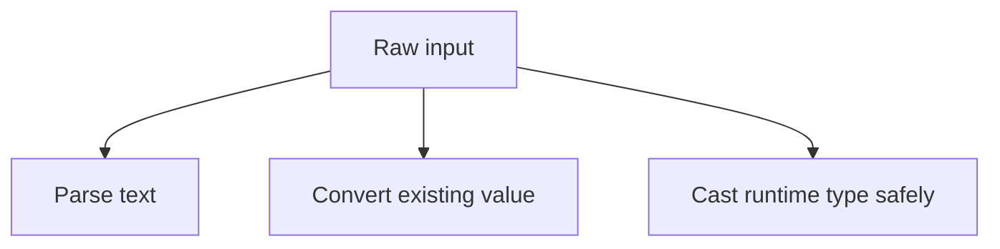

# Type Conversion and Parsing

Real applications rarely receive values in exactly the type they need. Input often arrives as text, objects, bytes, JSON values, or loosely typed data. Conversion and parsing are the bridge between that raw input and the strongly typed code you want to write.

Original Microsoft Learn reference: [Parse strings in .NET](https://learn.microsoft.com/en-us/dotnet/standard/base-types/parsing-strings).

## A practical mental model

It helps to separate three different ideas:

- parsing: interpreting text as a typed value
- conversion: transforming one value representation into another
- casting: treating an existing runtime value as a different type when allowed



## Prefer safe parsing APIs

If a value may be invalid, prefer `TryParse`-style APIs over methods that throw on failure.

```csharp
string input = "42";

if (int.TryParse(input, out int number))
{
    Console.WriteLine(number * 2);
}
else
{
    Console.WriteLine("Invalid number");
}
```

This pattern is easier to control than relying on exceptions for ordinary bad input.

That is why `TryParse`-style APIs are so common in production code. Invalid user input is often expected, not exceptional.

## Parsing is different from casting

Parsing turns one representation into another, often from text into a typed value. Casting changes how the compiler and runtime view an existing value.

Examples:

- parsing: `"123"` to `int`
- explicit numeric conversion: `double` to `int`
- reference or pattern cast: `object` to a specific runtime type

Understanding that distinction helps you choose the right tool instead of forcing everything into one mental bucket called conversion.

## Safe casting patterns

Pattern matching is usually the clearest modern way to test and extract a type.

```csharp
object value = 10;

if (value is int count)
{
    Console.WriteLine(count + 5);
}
```

Use `as` when working with nullable reference conversions and then check for `null` explicitly.

## A more practical example

```csharp
string quantityText = "12";

if (int.TryParse(quantityText, out int quantity))
{
    Console.WriteLine($"Valid quantity: {quantity}");
}
else
{
    Console.WriteLine("Quantity must be a whole number.");
}
```

This looks like real application validation because it turns external text into a usable typed value without throwing for expected bad input.

## Conversion design in your own types

Sometimes a type benefits from custom conversion operators, but use them carefully. A conversion should feel unsurprising. If the conversion can lose meaning, throw, or require complex rules, an explicit method is often better than an operator.

## Practical guidance

Good conversion code usually means:

- prefer `TryParse` for external or user-controlled text
- use pattern matching for safe runtime type extraction
- distinguish clearly between parsing and casting
- choose explicit conversions when meaning or precision could be lost

## Common beginner mistakes

- Using exceptions for ordinary invalid input when `TryParse` would be clearer.
- Confusing parsing from text with casting an existing value.
- Assuming every conversion should be implicit or automatic.
- Forgetting to check for `null` after using `as` with reference types.

## Summary

- parsing turns text into typed values
- conversion changes one value representation into another
- casting changes how the runtime value is treated when type rules allow it
- `TryParse` is often the safest choice for user input
- safe conversion design reduces both bugs and unclear failure behavior

## Practice

Write code that reads a string, tries to parse it as an `int`, and if that fails, reports the problem without throwing an exception.

As a second exercise, show one example of parsing, one of numeric conversion, and one of pattern-based casting, then explain why they are not the same operation.
