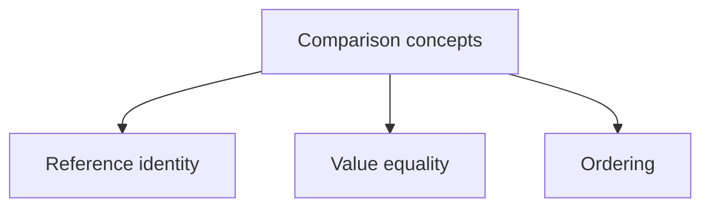

# Equality and Ordering

Equality feels simple until a program needs correct behavior in dictionaries, sets, searches, tests, and sorting rules. At that point, the difference between identity, value equality, and ordering semantics becomes important.

Original Microsoft Learn references: [Compare strings in .NET](https://learn.microsoft.com/en-us/dotnet/standard/base-types/comparing) and [Best practices for comparing strings in .NET](https://learn.microsoft.com/en-us/dotnet/standard/base-types/best-practices-strings).

## Three related but different ideas

It helps to separate these concepts clearly:

- reference identity: are these the same object instance
- value equality: should these values count as equal based on their contents
- ordering: which value should come before another



## Reference equality versus value equality

For many class types, two variables can refer to different objects even if those objects contain the same data. That is reference identity. Value equality asks whether the values should be considered equal based on their contents.

```csharp
var left = new Person("Lina", 30);
var right = new Person("Lina", 30);

Console.WriteLine(ReferenceEquals(left, right));
Console.WriteLine(left.Equals(right));

public sealed record Person(string Name, int Age);
```

Because `Person` is a record, `Equals` uses value-based comparison by default.

That example shows why records are often convenient for value-oriented types: the intended equality behavior is already built into the model.

## Why ordering is a separate decision

Two values can be equal or not equal, but ordering answers a different question: which value should come first. Ordering matters for sorting, binary search, range logic, and business rules.

In .NET, ordering is often expressed with:

- `IComparable<T>` on the type itself
- `IComparer<T>` when different orderings are needed
- LINQ operators such as `OrderBy` and `ThenBy`

Ordering is not automatically implied by equality. Two values might be unequal without there being one obvious universal ordering rule for them.

## Keep equality rules consistent

If you override equality for a type, the hash code contract matters too. Equal values must produce the same hash code. Otherwise collections such as `Dictionary<TKey, TValue>` and `HashSet<T>` can behave incorrectly.

## A more practical example

Suppose a `Money` type should consider amount and currency when deciding equality.

That would mean:

- `10 USD` equals `10 USD`
- `10 USD` does not equal `10 EUR`
- `10 USD` does not equal `12 USD`

But ordering may be a separate question. Should different currencies even be comparable in one default ordering? Sometimes the correct answer is no.

That is why equality and ordering should be designed deliberately instead of casually assumed.

## Common mistakes

Do not define equality casually for mutable types without thinking through the consequences. If the fields used for equality can change after insertion into a hash-based collection, the object can become difficult to find again.

## Practical guidance

Good equality and ordering design usually means:

- define equality from the domain meaning, not from convenience alone
- keep equality and hash code consistent
- treat ordering as a separate design decision
- be cautious with mutable types used as keys or set members

## Summary

- identity, equality, and ordering are related but distinct concepts
- value equality often matters for records, collections, and business rules
- hash-based collections depend on consistent equality and hash code behavior
- ordering should be designed deliberately rather than assumed automatically
- mutable equality-sensitive objects need extra caution in collections

## Practice

Choose a simple business type such as `Money`, `Coordinate`, or `Person`. Describe what should make two values equal and what ordering, if any, would be meaningful.

As a second exercise, explain why a mutable object can become problematic as a dictionary key if the fields used in equality can change after insertion.
