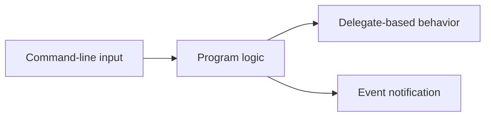

# Delegates, Events, and Command-Line Input

This guide brings together three practical topics that show up often in small tools and console programs. Delegates model executable behavior, events model notifications, and command-line input gives a program an external interface.

These topics fit well together because small tools often need to:

- accept input from outside the program
- pass behavior into reusable code
- notify other parts of the program when something happened

## Delegates as callable values

A delegate is a type that represents a method signature. You can store a method in a variable, pass it to another method, and combine it with other methods.

```csharp
Action<string> write = Console.WriteLine;
write("Hello from a delegate");
```

Delegates become especially useful when you want to pass behavior into reusable code.

For example, a small utility method might accept an `Action<string>` for logging instead of deciding on one output style itself.

## Events for notifications

Events build on delegates but restrict invocation so that only the declaring type can raise the event. Other code can subscribe and unsubscribe.

```csharp
var timer = new Countdown();
timer.Finished += () => Console.WriteLine("Done");

public class Countdown
{
    public event Action? Finished;

    public void Complete()
    {
        Finished?.Invoke();
    }
}
```

The event pattern helps separate the source of a state change from the code that reacts to it.

## A mental model



This is a useful model for small console tools: input comes in, work is done, and delegates or events can help structure behavior and notifications.

## Command-line arguments

Console applications often receive input through `args`.

```csharp
static void Main(string[] args)
{
    if (args.Length == 0)
    {
        Console.WriteLine("Please provide a name.");
        return;
    }

    Console.WriteLine($"Hello, {args[0]}!");
}
```

Good command-line handling means validating argument count, parsing values carefully, and giving clear feedback when input is missing or invalid.

## A more practical example

```csharp
static void Main(string[] args)
{
    var processor = new Processor();
    processor.Completed += () => Console.WriteLine("Processing finished.");

    if (args.Length == 0)
    {
        Console.WriteLine("Please provide a file path.");
        return;
    }

    processor.Run(args[0], Console.WriteLine);
}

public class Processor
{
    public event Action? Completed;

    public void Run(string input, Action<string> writeOutput)
    {
        writeOutput($"Processing: {input}");
        Completed?.Invoke();
    }
}
```

This small example combines all three ideas:

- command-line input through `args`
- a delegate for reusable output behavior
- an event for completion notification

## Practical guidance

Use delegates when:

- behavior should be passed into reusable code
- the caller should choose how an action is performed

Use events when:

- one part of the program should notify others about a state change
- the declaring type should control when the notification is raised

Handle command-line input carefully by:

- validating argument count
- parsing values safely
- providing clear help or error messages

## Common mistakes

Do not forget to unsubscribe from events when object lifetimes matter and long-lived publishers can keep subscribers alive unnecessarily. Also do not trust command-line input just because it came from your own machine. It is still external input.

## Summary

- delegates represent callable behavior
- events represent notifications with controlled invocation
- command-line arguments are external input and should be validated carefully
- these concepts often work well together in console tools and small utilities
- practical design depends on using each tool for its real role rather than mixing them casually

## Practice

Write a tiny console program that accepts one command-line argument and raises an event when processing finishes.

As a second exercise, refactor one console program idea so that output behavior is passed in as a delegate instead of being hard-coded inside the processing method.
