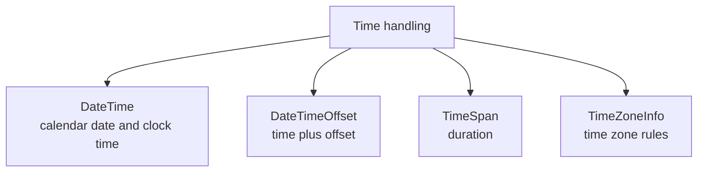
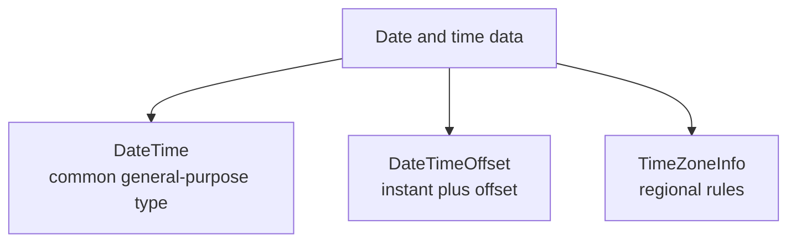

# Dates, Times, and Formatting

Dates and times look simple until a real application touches time zones, user input, storage, logging, or international formatting. .NET gives you several types for time-related work, and choosing the right one matters more than memorizing every API.

Original Microsoft Learn references: [Date and time in .NET](https://learn.microsoft.com/en-us/dotnet/standard/datetime/) and [Standard date and time format strings](https://learn.microsoft.com/en-us/dotnet/standard/base-types/standard-date-and-time-format-strings).

## Start with the right type

The most common time-related types are:

- `DateTime`
- `DateTimeOffset`
- `TimeSpan`
- `TimeZoneInfo`



As a practical default, `DateTimeOffset` is often safer for timestamps that move between systems because it preserves an offset from UTC.

## `DateTime` versus `DateTimeOffset`

`DateTime` stores a date and clock time, plus a `Kind` that hints whether the value is local, UTC, or unspecified.

`DateTimeOffset` stores a date and time together with an explicit UTC offset.

```csharp
DateTime utcNow = DateTime.UtcNow;
DateTimeOffset timestamp = DateTimeOffset.UtcNow;
```

If you need a durable point in time for logging, auditing, or distributed systems, `DateTimeOffset` is usually clearer.

## Measuring durations with `TimeSpan`

Use `TimeSpan` for durations, not `DateTime`.

```csharp
TimeSpan timeout = TimeSpan.FromSeconds(30);
TimeSpan retryDelay = TimeSpan.FromMinutes(2);
```

That keeps durations separate from calendar timestamps.

## Formatting output

Dates and times can be formatted with standard or custom format strings.

```csharp
DateTimeOffset now = DateTimeOffset.UtcNow;

Console.WriteLine(now.ToString("O"));
Console.WriteLine(now.ToString("yyyy-MM-dd"));
Console.WriteLine(now.ToString("HH:mm:ss"));
```

The round-trip format specifier `O` is especially useful for logs and serialized text because it is precise and culture-independent.

## Parsing input safely

Prefer `TryParse` or `TryParseExact` when the input may be invalid.

```csharp
string input = "2026-06-06";

if (DateOnly.TryParse(input, out DateOnly date))
{
    Console.WriteLine(date);
}
```

When the expected format is known, `TryParseExact` gives you tighter control.

```csharp
using System.Globalization;

string text = "2026-06-06 18:30";

bool ok = DateTime.TryParseExact(
    text,
    "yyyy-MM-dd HH:mm",
    CultureInfo.InvariantCulture,
    DateTimeStyles.AssumeUniversal,
    out DateTime parsed);
```

## Time zones and UTC

A common rule of thumb is:

- store machine-friendly timestamps in UTC
- convert to the user's local display time near the edges of the system

```csharp
DateTimeOffset utcTimestamp = DateTimeOffset.UtcNow;
TimeZoneInfo eastern = TimeZoneInfo.FindSystemTimeZoneById("Eastern Standard Time");
DateTimeOffset localValue = TimeZoneInfo.ConvertTime(utcTimestamp, eastern);
```

Time zone rules can change, and daylight saving transitions introduce ambiguity. That is why UTC storage is usually the simplest default.

## Date-only and time-only values

When you mean only a calendar date or only a clock time, use `DateOnly` or `TimeOnly` instead of forcing the concept into `DateTime`.

```csharp
DateOnly dueDate = new(2026, 6, 30);
TimeOnly openingTime = new(9, 0);
```

Those types reduce accidental confusion about midnight values or irrelevant time zones.

## A practical example

```csharp
using System.Globalization;

string input = "2026-06-06T15:45:00+00:00";

if (DateTimeOffset.TryParse(input, CultureInfo.InvariantCulture, out DateTimeOffset createdAt))
{
    Console.WriteLine($"Stored timestamp: {createdAt:O}");
    Console.WriteLine($"Display date: {createdAt:yyyy-MM-dd}");
}
```

This is a realistic pattern: parse input, store the actual timestamp, and format it differently for display.

## Common mistakes

- Using local time for stored audit data that must compare across machines.
- Using `DateTime` for durations instead of `TimeSpan`.
- Parsing dates without thinking about culture or format assumptions.
- Treating `DateTime.MinValue` as a substitute for an optional date instead of using `DateTime?`.

## Practical guidance

- Prefer `DateTimeOffset` for timestamps that cross process or machine boundaries.
- Prefer UTC for storage and logs.
- Use `TimeSpan` for durations and delays.
- Use `DateOnly` and `TimeOnly` when the domain really means only a date or only a time.
- Use invariant, round-trippable formats for persistence and diagnostics.

## Summary

- time handling in .NET is easier when you choose the right type up front
- `DateTimeOffset` is often the safest timestamp default
- `TimeSpan` models durations, not calendar moments
- formatting and parsing should be explicit when correctness matters
- time zones and culture rules are part of the design, not incidental details

## Practice

Write a small example that stores a timestamp in UTC and then formats it for human-readable output.

As a second exercise, parse a fixed date string with `TryParseExact` and explain why that is safer than relying on machine culture defaults.



Choosing the wrong model early creates subtle bugs later.

## `DateTime` versus `DateTimeOffset`

`DateTime` is common and useful, but it can be ambiguous because its meaning depends partly on the `Kind` value.

`DateTimeOffset` is often the safer choice for timestamps because it carries an offset with the value.

```csharp
DateTime localTime = DateTime.Now;
DateTime utcTime = DateTime.UtcNow;
DateTimeOffset timestamp = DateTimeOffset.UtcNow;
```

In many application designs:

- use `DateTimeOffset` for stored timestamps and event times
- use UTC internally when possible
- convert to local time only when presenting data to people

## Why UTC matters

UTC avoids ambiguity caused by daylight saving transitions and machine-local settings.

```csharp
DateTimeOffset createdAt = DateTimeOffset.UtcNow;
Console.WriteLine(createdAt);
```

If you store timestamps in UTC, comparisons and ordering are usually much easier.

## Working with time zones

`TimeZoneInfo` represents regional rules.

```csharp
TimeZoneInfo tehran = TimeZoneInfo.FindSystemTimeZoneById("Iran Standard Time");
DateTimeOffset utcNow = DateTimeOffset.UtcNow;
DateTimeOffset localTehran = TimeZoneInfo.ConvertTime(utcNow, tehran);
```

The exact time zone ID depends on the platform, so cross-platform apps must be careful about identifiers and deployment assumptions.

## Formatting for display

Format strings control how date and time values become text.

```csharp
DateTimeOffset now = DateTimeOffset.UtcNow;

Console.WriteLine(now.ToString("O"));
Console.WriteLine(now.ToString("yyyy-MM-dd"));
Console.WriteLine(now.ToString("HH:mm:ss"));
```

Useful standard formats include:

- `O` for round-trip, machine-friendly timestamps
- `d` for short date display using culture rules
- `D` for long date display using culture rules
- `t` and `T` for short and long time display

## Parsing safely

Prefer `TryParse` or `TryParseExact` when input may be invalid.

```csharp
string input = "2026-06-06";

if (DateTime.TryParse(input, out DateTime date))
{
    Console.WriteLine(date);
}
```

If you need a strict format, use `TryParseExact`.

```csharp
using System.Globalization;

string text = "2026-06-06 14:30";

bool parsed = DateTime.TryParseExact(
    text,
    "yyyy-MM-dd HH:mm",
    CultureInfo.InvariantCulture,
    DateTimeStyles.AssumeUniversal,
    out DateTime result);
```

This avoids culture-dependent surprises.

## Culture affects formatting and parsing

Dates are not displayed the same way in every culture. A format that looks normal to one user may look incorrect to another.

```csharp
using System.Globalization;

DateTime value = new(2026, 6, 6);

Console.WriteLine(value.ToString("d", CultureInfo.GetCultureInfo("en-US")));
Console.WriteLine(value.ToString("d", CultureInfo.GetCultureInfo("fr-FR")));
```

This is why machine-to-machine formats and human-facing formats should be treated differently.

## Durations are different from timestamps

Use `TimeSpan` for elapsed time or durations.

```csharp
TimeSpan buildTime = TimeSpan.FromMinutes(3.5);
Console.WriteLine(buildTime.TotalSeconds);
```

Do not misuse `DateTime` to represent a duration. A duration is not a calendar moment.

## A practical example

```csharp
using System.Globalization;

DateTimeOffset createdAt = DateTimeOffset.UtcNow;
string apiValue = createdAt.ToString("O", CultureInfo.InvariantCulture);

if (DateTimeOffset.TryParse(apiValue, CultureInfo.InvariantCulture, DateTimeStyles.RoundtripKind, out DateTimeOffset parsed))
{
    Console.WriteLine($"Stored timestamp: {parsed:O}");
    Console.WriteLine($"Display date: {parsed:yyyy-MM-dd}");
}
```

This example shows the common pattern of storing a machine-stable value and formatting a user-facing value separately.

## Common mistakes

- Using local time everywhere and then comparing timestamps across machines.
- Storing ambiguous `DateTime` values without understanding `Kind`.
- Parsing dates with culture-sensitive defaults when the input format is fixed.
- Using `DateTime` to represent a duration instead of `TimeSpan`.

## Practical guidance

- Prefer UTC for internal timestamps.
- Prefer `DateTimeOffset` when you need to represent a real instant in time.
- Use `TryParseExact` for strict external formats.
- Separate machine-safe serialization formats from human display formats.
- Use `TimeZoneInfo` only when regional clock rules actually matter.

## Summary

- date and time work becomes easier when you distinguish instants, local times, and durations
- `DateTimeOffset` is often safer than `DateTime` for timestamps
- UTC reduces ambiguity and comparison problems
- culture-aware formatting is for people, while invariant formats are often for storage and transport
- `TimeSpan` represents elapsed time, not dates

## Practice

Write code that stores the current time as a UTC timestamp and prints it in both round-trip and user-friendly formats.

As a second exercise, parse a fixed-format timestamp with `TryParseExact` and explain why that is safer than relying on the current machine culture.
