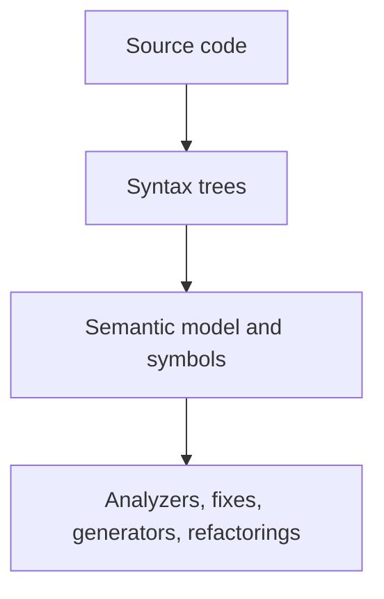

# Roslyn SDK Overview

Roslyn is the .NET Compiler Platform. It is more than the component that turns C# source code into assemblies. It also exposes the compiler's internal models so tools can inspect, analyze, and transform code in structured ways.

Original Microsoft Learn reference: [Microsoft Learn Roslyn SDK](https://learn.microsoft.com/dotnet/csharp/roslyn-sdk/).

That is why Roslyn powers features such as syntax highlighting, code navigation, quick fixes, analyzers, refactorings, and source generators.

## Why Roslyn matters

Before Roslyn, many code-analysis tools relied on text processing or loosely integrated compiler hooks. Roslyn made the compiler itself programmable, which gives tooling direct access to syntax trees, symbols, types, and project structure.

This enables tools that can answer questions such as:

- what symbols are declared in this file
- what type does this expression have
- where is this method used
- can this code be safely rewritten automatically

## A practical mental model

Roslyn is easiest to understand when you see it as a layered tooling platform.

The earlier layers answer structure questions. The later layers use that information to provide developer-facing tooling.

## Main Roslyn concepts

The most important Roslyn building blocks are:

- syntax trees, which describe code structure
- semantic models, which explain meaning
- analyzers, which report diagnostics
- code fixes, which offer automated repairs
- source generators, which add code during compilation
- workspaces, which model projects, documents, and solutions

## Example perspective

If a tool wants to find every `if` statement in a file, syntax is enough. If it wants to know whether an expression is of type `string`, it needs semantics. If it wants to offer a fix across an entire solution, it usually also needs workspace information.

This “what question is the tool asking” mindset is more useful than memorizing API names in isolation.

## Where learners usually first meet Roslyn

Even if you have never written a Roslyn tool, you already benefit from Roslyn when you use:

- error squiggles in the editor
- rename refactoring
- code actions and quick fixes
- warnings from analyzers
- generated code created during compilation

That is important because Roslyn is not an abstract compiler topic only for tool authors. It is already part of normal day-to-day .NET development.

## A practical mindset

Roslyn becomes easier to learn when you tie each API surface to a concrete task. Do not start by memorizing types. Start by asking what problem the tool is trying to solve.

## Summary

- Roslyn is the .NET compiler platform plus a rich programmable model of code
- it supports both compilation and higher-level tooling
- syntax, semantics, analyzers, fixes, generators, and workspaces are the main building blocks
- the right Roslyn API depends on the question the tool needs to answer
- many everyday editor features already depend on Roslyn behind the scenes

## Practice

Pick one editor feature you use often, such as rename, quick fixes, or warnings. Describe which Roslyn concepts it likely depends on.

As a second exercise, explain why plain text search alone would not be enough to implement a trustworthy rename refactoring.
