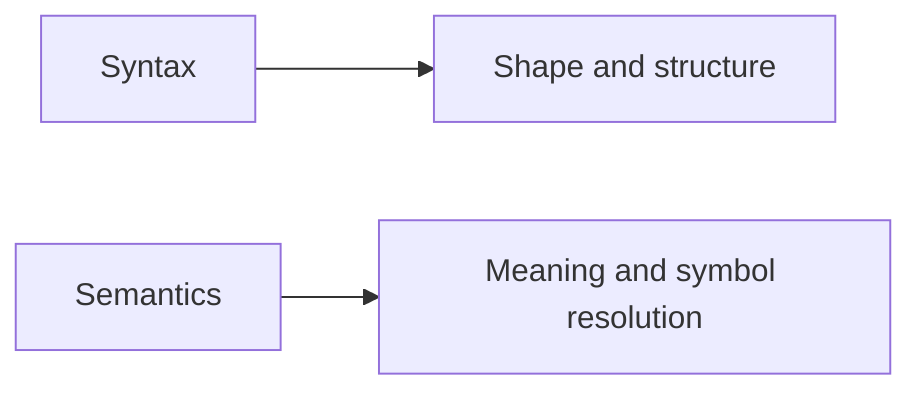

# Syntax and Semantic Analysis

The difference between syntax and semantics is the foundation of Roslyn work. Syntax tells you how code is written. Semantics tell you what that code means.

Original Microsoft Learn reference: [Microsoft Learn Roslyn SDK](https://learn.microsoft.com/dotnet/csharp/roslyn-sdk/).

## A simple comparison

This distinction explains a large part of how Roslyn APIs are organized.

## Syntax: structure only

A syntax tree represents the structure of source code as tokens and nodes. It knows that `Customer customer = new();` is a local declaration statement with specific pieces, even if the code does not compile fully.

That makes syntax analysis useful for tasks such as:

- finding declarations by shape
- locating specific statements or expressions
- enforcing formatting or style patterns
- working with incomplete code in the editor

Syntax is especially valuable when you care about the written form of code more than its final resolved meaning.

## Semantics: meaning and symbols

Semantic analysis answers questions that syntax alone cannot answer.

- Which `Customer` type does this identifier refer to?
- What is the type of this expression?
- Which overload was chosen?
- Is this member accessible here?

That information comes from the semantic model and symbol APIs.

## Example difference

Two method calls might have identical syntax shapes but resolve to different overloads depending on imports, type inference, and available members. Syntax sees the call expression. Semantics explains which method is actually being called.

This is why text shape alone is often insufficient for trustworthy analysis.

## When syntax is enough

If you only need structure, stay at the syntax level. It is usually simpler and cheaper than semantic analysis.

Examples include:

- finding empty `catch` blocks
- locating all `if` statements
- checking whether a property declaration has an initializer

## When semantics is required

If the tool depends on types, symbol identity, accessibility, overload resolution, or conversions, syntax alone is not enough.

Examples include:

- finding all methods that return `string`
- checking whether a call resolves to a specific API
- detecting invalid type usage across namespaces and aliases

## Why both are often used together

Many real tools combine both layers.

For example, an analyzer may:

- use syntax to quickly find candidate nodes
- use semantics to confirm whether the candidate truly matches the rule

That combination keeps the tool both efficient and accurate.

## Summary

- syntax answers structure questions
- semantics answers meaning and symbol questions
- syntax is often simpler and cheaper
- semantics is necessary when types, resolution, or identity matter
- many useful tools combine both rather than choosing only one

## Practice

Take one code inspection idea, such as "find every empty catch block" or "find all string-returning methods." Decide whether syntax, semantics, or both are required.

As a second exercise, describe one false positive that could happen if a tool used syntax alone when semantics was actually required.
