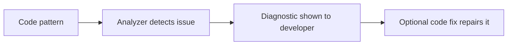

# Analyzers and Code Fixes

Analyzers let teams move coding guidance out of documents and into the compiler pipeline. Instead of hoping every developer remembers a rule, an analyzer can detect the issue automatically and report a diagnostic in the editor or build output.

Original Microsoft Learn reference: [Microsoft Learn Roslyn SDK](https://learn.microsoft.com/dotnet/csharp/roslyn-sdk/).

## The basic workflow

This flow is what makes analyzers practical rather than theoretical. The developer sees the issue where the code is being written.

## What analyzers do

An analyzer inspects code and reports diagnostics when it finds a pattern worth flagging. That pattern might be:

- a correctness issue
- a performance risk
- an API misuse
- a style rule
- a library-specific recommendation

Analyzers are valuable because they turn best practices into consistent feedback instead of depending only on memory or code review luck.

## What code fixes do

A code fix is the guided repair for a diagnostic. It turns a warning or suggestion into an actionable refactoring the developer can apply directly.

This pairing matters because diagnostics without remediation can become noisy. A good code fix reduces friction and helps teams adopt rules instead of ignoring them.

## Severity and intent

Not every rule should be an error. Some diagnostics are suggestions or informational hints. Choosing severity well is part of good engineering judgment.

If every rule is treated like a build-breaking failure, developers often stop trusting the tool. If every rule is too weak, important problems are ignored.

## Practical examples

Common analyzer scenarios include:

- discouraging synchronous blocking in async code
- requiring `StringComparison` in string comparisons
- preventing obsolete API usage
- enforcing naming or design conventions

## What makes a good diagnostic

A useful diagnostic usually has three qualities:

- it identifies a real problem or meaningful improvement
- it explains the issue clearly
- it points the developer toward a safe next step

That means analyzer design is not only about detection logic. It is also about the clarity of the engineering feedback.

## When a code fix is especially valuable

Code fixes are strongest when:

- the repair is mechanical and safe
- the correct intent is reasonably clear
- many developers would otherwise make the same repetitive fix manually

## Summary

- analyzers detect patterns and report diagnostics
- code fixes provide guided, often automated repairs
- severity should match the real engineering importance of the rule
- effective analyzer tooling depends on both accurate detection and useful messaging
- the goal is not noise, but consistent and actionable guidance

## Practice

Think of one mistake your team could detect automatically. Describe what the diagnostic message should say and whether the rule should be a suggestion, warning, or error.

As a second exercise, explain why a rule with a poor diagnostic message can still be frustrating even if its detection logic is technically correct.
