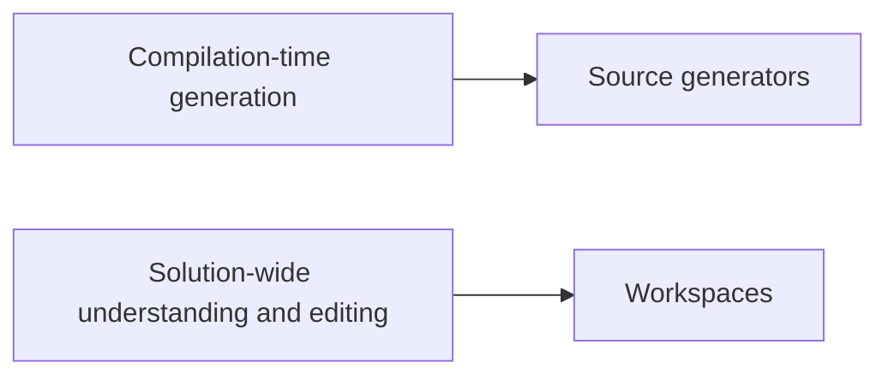

# Source Generators and Workspaces

Source generators and workspaces sit at two powerful ends of the Roslyn platform. Source generators participate in compilation by adding generated code. Workspaces model entire solutions so tools can analyze and edit code across many files and projects.

Original Microsoft Learn reference: [Microsoft Learn Roslyn SDK](https://learn.microsoft.com/dotnet/csharp/roslyn-sdk/).

## Two different kinds of power

They are related because both operate on code in structured ways, but they solve different categories of problems.

## Source generators

A source generator inspects the compilation and adds new source code during build. This is useful when repetitive boilerplate can be derived from existing declarations, attributes, or metadata.

Typical scenarios include:

- generating serialization helpers
- generating strongly typed APIs from metadata
- creating registration or mapping code
- reducing runtime reflection in favor of compile-time code generation

Incremental generators improve efficiency by recalculating only the parts that changed.

The key idea is that a source generator contributes new code to the compilation process itself.

## Workspaces

The workspace APIs represent documents, projects, and solutions. They are used by tools that need to understand or modify code across a larger scope than one file.

Examples include:

- rename across a solution
- batch refactorings
- tooling that edits project-wide code
- custom analysis over many documents

The key idea is that workspaces help tooling understand and manipulate the development environment as a whole.

## The difference in intent

Source generators are about producing code as part of compilation. Workspaces are about understanding and editing code in the broader development environment.

That difference is important because developers sometimes confuse source generation with general code transformation. They solve related but different problems.

## Choosing the right tool

Ask these questions:

- should new code be produced automatically during build
- or should existing code be inspected or modified across files and projects
- or is the problem simple enough that an ordinary reusable library API is already enough

Not every repetition problem needs source generation. Sometimes a well-designed library method is the simpler and more maintainable answer.

## Summary

- source generators add code during compilation
- workspaces model solutions, projects, and documents for broader tooling tasks
- they solve different problems even though both live in the Roslyn ecosystem
- incremental generators improve performance by avoiding unnecessary recomputation
- the right choice depends on whether the goal is build-time generation, solution-wide editing, or neither

## Practice

Choose one repetitive coding pattern you have seen before. Decide whether it is better solved by a source generator, a workspace-based refactoring, or ordinary library code.

As a second exercise, explain why rename refactoring belongs naturally to workspace-based tooling rather than to source generation.
