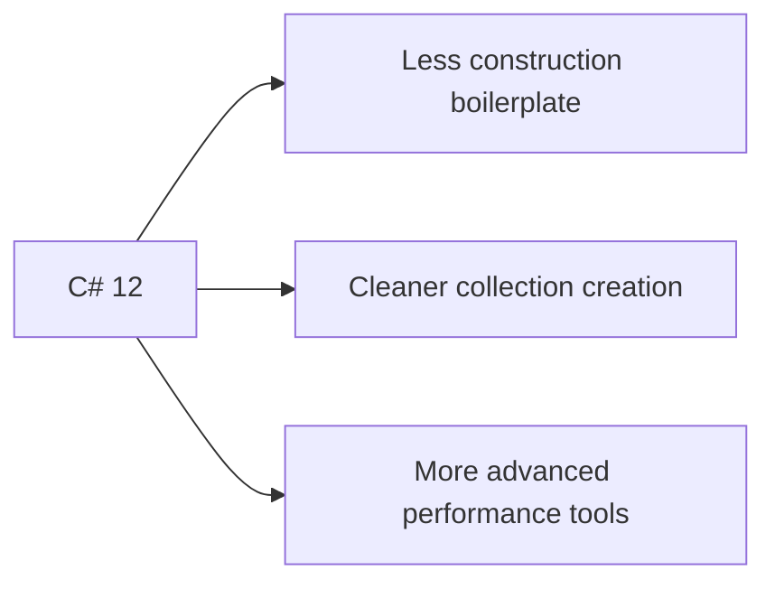

# What's New in C# 12

C# 12 was the language version that shipped with .NET 8. It added features that improved day-to-day expressiveness, especially around construction, collection creation, and low-level performance-oriented scenarios.

## A practical theme for C# 12

The most useful way to think about C# 12 is that it reduced boilerplate in several common places.



## Primary constructors

One of the most visible additions was primary constructors for classes and structs, not only for records.

```csharp
public class Course(string title)
{
    public string Title { get; } = title;
}
```

This syntax reduces boilerplate when constructor parameters naturally belong to the type's setup logic.

It is most helpful when the constructor is simple and closely tied to the type's core state.

## Collection expressions

Collection expressions introduced a concise way to create arrays, lists, spans, and similar collection-like values.

```csharp
int[] values = [1, 2, 3, 4];
List<string> names = ["Ada", "Lina", "Sara"];
int[] combined = [.. values, 5, 6];
```

This is one of the most practical C# 12 features because it improves readability in many ordinary code paths.

For learners and everyday application code, collection expressions are often the most immediately useful C# 12 feature.

## Other important additions

Microsoft's C# 12 documentation also highlights:

- `ref readonly` parameters
- default values for lambda parameters
- aliasing any type with `using`
- inline arrays for specialized performance scenarios
- the `Experimental` attribute

Some of these features matter mainly to library authors or performance-sensitive code, while collection expressions and primary constructors have broader everyday value.

## Adoption guidance

Use new syntax when it genuinely clarifies code. Do not rewrite working code just to chase novelty. A feature earns its place when it reduces boilerplate or makes intent easier to read.

For many teams, a good adoption order is:

- start with collection expressions where they clearly improve readability
- use primary constructors when the type setup is straightforward
- leave the more specialized performance-oriented features for cases that truly need them

## Summary

- C# 12 focused strongly on reducing boilerplate
- primary constructors simplify some type declarations
- collection expressions are one of the most broadly useful additions
- several other features target library authors or performance-sensitive code
- adoption should be driven by readability and fit, not novelty alone

## Practice

Take a class with a simple constructor and one collection initialization example. Rewrite them using C# 12 syntax and compare readability.

As a second exercise, explain one case where a primary constructor improves the design and one case where a regular constructor might still be clearer.
