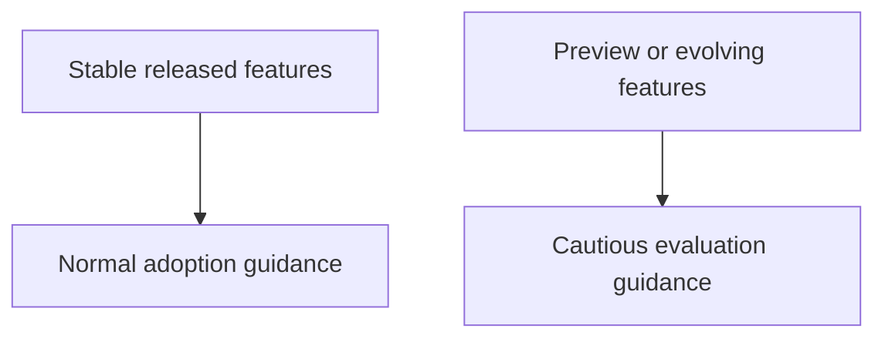

# What's New in C# 14 and C# 15

The newest C# versions need the most careful explanation because the support picture changes fastest. Stable features should be taught as normal language features. Preview features should be labeled clearly so readers do not confuse exploration with production guidance.

Original Microsoft Learn reference: [Microsoft Learn What's new in C#](https://learn.microsoft.com/dotnet/csharp/whats-new/).

## A practical mental model



This distinction matters more in the newest language versions because the feature surface can still evolve.

## Stable C# 14 additions

According to the current Microsoft documentation, C# 14 includes several important additions, including:

- extension members
- the `field` keyword for field-backed properties
- implicit span conversions
- `nameof` support for unbound generic types
- modifiers on simple lambda parameters
- more partial members
- null-conditional assignment

```csharp
customer?.Order = GetCurrentOrder();
```

Null-conditional assignment is a good example of a feature that removes repetitive boilerplate while staying easy to read.

## Extension members

Extension members are one of the most notable additions because they extend the older extension-method model. They make it possible to express richer extension APIs, including extension properties and static-style extension members.

The practical question is not only whether they are powerful, but whether they make an API easier to understand than the older alternatives.

## The `field` keyword

The `field` keyword reduces the need for explicit backing fields in some property accessors.

```csharp
public string Message
{
    get;
    set => field = value ?? throw new ArgumentNullException(nameof(value));
}
```

This feature is useful when custom accessor logic is needed, but a separate private field would only add noise.

## About C# 15

For C# 15, the right teaching posture is caution. Preview features can evolve before final release. In this repository, preview-only material should be labeled as preview, kept high level, and updated when the feature set stabilizes.

That means this chapter should help readers reason about adoption rather than encouraging them to treat all preview ideas as settled language law.

## A practical rule for new language features

Ask three questions before adopting a new feature broadly:

- Does it make intent clearer?
- Is it stable in the toolchain you target?
- Will the team understand it without extra friction?

## Summary

- the newest C# versions require the most careful compatibility thinking
- stable features can be taught and adopted normally once toolchain support is clear
- preview features should be explained cautiously and labeled clearly
- C# 14 includes several features aimed at reducing boilerplate and expanding expressive APIs
- the best adoption rule is clarity plus stability, not novelty alone

## Practice

Pick one repetitive null-check or backing-field example from older code and see whether a C# 14 feature improves it without making the code less obvious.

As a second exercise, explain why preview features should be documented differently from stable released features in a learning repository.
