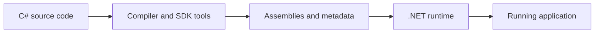

# .NET Platform Overview

.NET is the platform that runs C# programs, supplies the standard libraries, and provides the SDK tools used to build, test, package, and publish applications. C# is the language; .NET is the runtime, library, and tooling ecosystem that makes C# useful beyond isolated syntax examples.

Original Microsoft Learn reference: [Microsoft Learn Introduction to .NET](https://learn.microsoft.com/dotnet/core/introduction).

## Why this chapter matters

Earlier chapters focused mostly on the C# language itself. This chapter steps one level lower and wider:

- lower, because it explains the runtime and execution environment beneath the language
- wider, because it explains the tooling and platform concepts that shape real .NET applications

If you only learn syntax, it is easy to write code without understanding how the program is built, loaded, configured, diagnosed, or deployed.

## What belongs in this chapter

This chapter focuses on platform concepts that apply across many kinds of .NET programs. It does not try to teach specific application stacks or UI frameworks in detail.

- the runtime and managed execution model
- the common type system and base class library
- target frameworks and compatibility
- SDK-style projects, MSBuild, and NuGet
- configuration, dependency injection, hosting, and logging
- diagnostics, memory management, publishing, and security basics

## A practical mental model

A C# source file is compiled by the C# compiler into an assembly. The .NET runtime loads that assembly, just-in-time compiles or executes prepared code, manages memory, handles exceptions, and connects your code to a large standard library.

## C# and .NET are related but not identical

This distinction matters:

- C# gives you language features such as classes, pattern matching, generics, lambdas, and async syntax
- .NET gives you the runtime, libraries, SDK, package system, hosting infrastructure, diagnostics tools, and deployment model

That is why two questions that sound similar are actually different:

- "How do I express this idea in C#?"
- "How does this .NET application build, run, and behave in production?"

## What a learner should take away

By the end of this chapter, a learner should understand that building a .NET application usually means working with several layers together:

- language features in source files
- project and SDK configuration in the project system
- runtime behavior during execution
- libraries and external packages
- deployment choices for the target environment

## Summary

- C# is the language, while .NET is the larger runtime, library, and tooling platform
- real application development depends on both language knowledge and platform knowledge
- the .NET SDK, runtime, libraries, and deployment model all influence how code behaves
- this chapter focuses on cross-cutting platform concepts rather than one application framework

## Practice

Run `dotnet --info` and identify the SDK version, runtimes, operating system, architecture, and base path. Those details explain many build and runtime behaviors later.

As a second exercise, explain the difference between "learning C# syntax" and "understanding how a .NET application works end to end."
