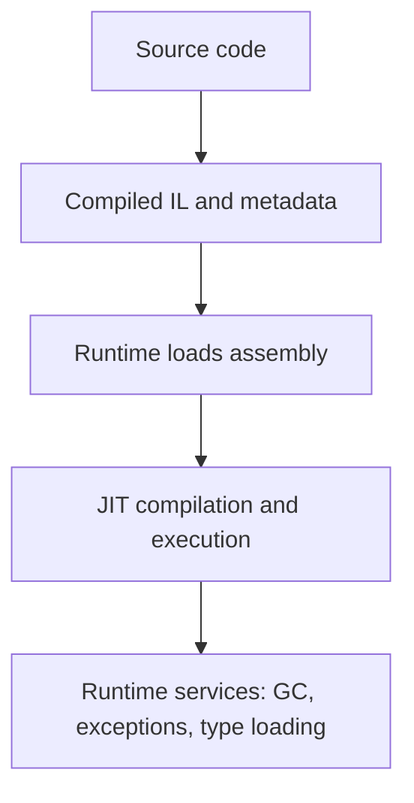

# Runtime, CLR, and Managed Execution

The .NET runtime is the execution environment for managed code. It loads assemblies, verifies and executes code, manages memory, handles exceptions, and provides services that C# programs depend on.

Original Microsoft Learn reference: [Microsoft Learn Introduction to .NET](https://learn.microsoft.com/dotnet/core/introduction).

## A practical mental model



## Key ideas

- Managed code runs under runtime services such as garbage collection and exception handling.
- Assemblies contain compiled code and metadata that the runtime can inspect.
- The Common Language Runtime, or CLR, is the runtime model behind modern .NET execution.
- Just-in-time compilation turns intermediate language into native machine code when needed.

## What managed execution really means

When developers hear "managed code," they sometimes think it simply means code written in C#. The more useful meaning is this: the runtime is actively involved in execution.

That involvement includes:

- loading assemblies and resolving dependencies
- creating and tracking managed objects
- handling exceptions across frames
- inspecting metadata for reflection and type identity
- compiling IL to native instructions when code is executed

## Why it matters

Many C# features are language syntax over runtime behavior. `try` and `catch` depend on the runtime exception model. `using` often works with `IDisposable`. Generics, reflection, async tasks, and type loading all rely on runtime services.

This is why a .NET application cannot be understood only by reading C# syntax. Runtime behavior is part of the program model.

## Output files and execution

```bash
dotnet build
dotnet run
```

The first command compiles the project. The second command starts the runtime with the built assembly and any required dependencies.

In the output folder, files such as `.dll`, `.deps.json`, and `.runtimeconfig.json` help describe what the program is, what it depends on, and how it should run.

## Common beginner mistakes

- Assuming the compiler alone explains all behavior.
- Treating tasks, exceptions, and generics as purely language-only features.
- Ignoring the runtime files produced during build and publish output.

## Summary

- the runtime executes managed code and provides essential services during execution
- assemblies contain both compiled instructions and metadata
- JIT compilation translates intermediate code into native instructions as needed
- many important C# features depend on runtime behavior underneath the language syntax

## Practice

Build a console project and inspect the output folder. Notice the `.dll`, `.deps.json`, and `.runtimeconfig.json` files. Each one participates in how .NET finds dependencies and runs the program.

As a second exercise, explain why `async`, exceptions, and reflection are easier to understand once you remember that the runtime is actively involved in execution.
