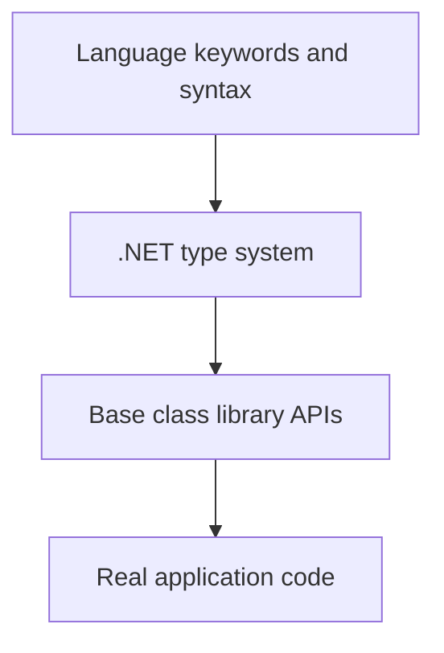

# Common Type System and Base Class Library

The Common Type System defines how .NET understands types, values, objects, inheritance, interfaces, arrays, delegates, and generics. The Base Class Library supplies the everyday APIs that C# programs use.

Original Microsoft Learn reference: [Microsoft Learn Introduction to .NET](https://learn.microsoft.com/dotnet/core/introduction).

## A practical mental model



This matters because C# code feels like language syntax on the surface, but much of its meaning depends on runtime types and library APIs underneath.

## Key ideas

- C# primitive aliases such as `int`, `string`, and `bool` map to .NET types such as `System.Int32`, `System.String`, and `System.Boolean`.
- Value types and reference types are runtime concepts, not only C# syntax categories.
- Generics are supported by the runtime and are used throughout the standard library.
- The base libraries include collections, I/O, text, dates, diagnostics, networking primitives, and more.

## Why the common type system matters

The common type system is one reason .NET languages can interoperate cleanly. A type is not just a compiler trick. It has shared runtime meaning.

That shared model affects:

- how inheritance and interfaces behave
- how boxing and unboxing work
- how arrays, delegates, and exceptions are represented
- how generics and reflection interact with code

## Why the base class library matters

The Base Class Library, often called the BCL, is the large collection of standard APIs that most .NET programs use every day.

Typical areas include:

- collections such as `List<T>` and `Dictionary<TKey, TValue>`
- text APIs such as `string`, `StringBuilder`, and encodings
- file and stream APIs
- date and time APIs
- tasks, threading, diagnostics, and networking primitives

Without the library, the language would be far less practical.

## Example

```csharp
int count = 3;
System.Int32 sameCount = count;

List<string> names = ["Ada", "Grace"];
Console.WriteLine(names.Count);
```

The language aliases make code pleasant to read, while the runtime and libraries provide the actual type definitions and behavior.

## Practical guidance

When learning a C# feature, it is often worth asking:

- is this mainly language syntax
- mainly runtime behavior
- mainly a library API pattern
- or a combination of all three

That question helps learners avoid putting every concept in the same bucket.

## Summary

- the common type system gives .NET a shared model for types and values
- C# aliases usually map to runtime types in `System.*`
- the BCL provides the standard APIs that make application development practical
- many everyday coding tasks depend more on library fluency than on raw syntax alone

## Practice

Pick five C# keywords or aliases you use often and find the corresponding `System.*` type or library API in the .NET API reference.

As a second exercise, choose one familiar C# construct and explain which part comes from the language, which part comes from the runtime type system, and which part comes from the library surface.
