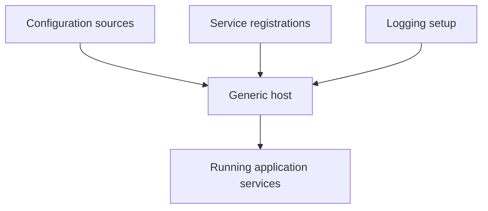

# Configuration, Dependency Injection, and Generic Host

Modern .NET libraries share common infrastructure for configuration, dependency injection, logging, and application lifetime management. These concepts are not limited to web applications.

Original Microsoft Learn references: [Configuration in .NET](https://learn.microsoft.com/en-us/dotnet/core/extensions/configuration), [Dependency injection in .NET](https://learn.microsoft.com/en-us/dotnet/core/extensions/dependency-injection), and [.NET Generic Host](https://learn.microsoft.com/en-us/dotnet/core/extensions/generic-host).

## A practical mental model



## Key ideas

- Configuration combines values from files, environment variables, command-line arguments, and other providers.
- Dependency injection helps code ask for abstractions instead of constructing every dependency directly.
- The generic host coordinates services, configuration, logging, and lifetime events.
- Worker services and console tools can use the same hosting model as larger applications.

## Why these ideas belong together

Developers often learn configuration, dependency injection, and hosting as separate topics. In real .NET applications, they are usually coordinated together.

For example:

- configuration provides values such as connection strings or feature flags
- dependency injection supplies services that use those values
- the host wires up application lifetime, logging, and startup behavior

## Example

```csharp
using Microsoft.Extensions.DependencyInjection;

ServiceCollection services = new();
services.AddSingleton<IClock, SystemClock>();

ServiceProvider provider = services.BuildServiceProvider();
IClock clock = provider.GetRequiredService<IClock>();
```

This pattern is most useful when dependencies have interfaces, lifetimes, or configuration-driven behavior.

## Practical guidance

Dependency injection is most helpful when:

- a class should depend on an abstraction rather than a concrete helper it constructs itself
- service lifetimes matter
- behavior depends on configuration or environment-specific implementations

The generic host is useful when:

- the application needs coordinated startup and shutdown behavior
- configuration, logging, and service registration should be standardized
- console or worker applications are growing beyond a tiny single-file script

## Common beginner mistakes

- Using dependency injection as ceremony even when a simple direct dependency would be clearer.
- Treating configuration values as magic global state instead of explicit application input.
- Assuming hosting infrastructure is only for web applications.

## Summary

- configuration, dependency injection, and hosting usually work together in modern .NET applications
- configuration provides values, DI provides services, and the host coordinates the application environment
- these patterns are useful beyond ASP.NET Core and can improve console and worker applications too

## Practice

Refactor a class that directly creates a helper object so the helper is passed through the constructor. Then register both types in a `ServiceCollection`.

As a second exercise, explain when a simple console tool might be better kept lightweight and when it has grown enough that a generic host becomes useful.
