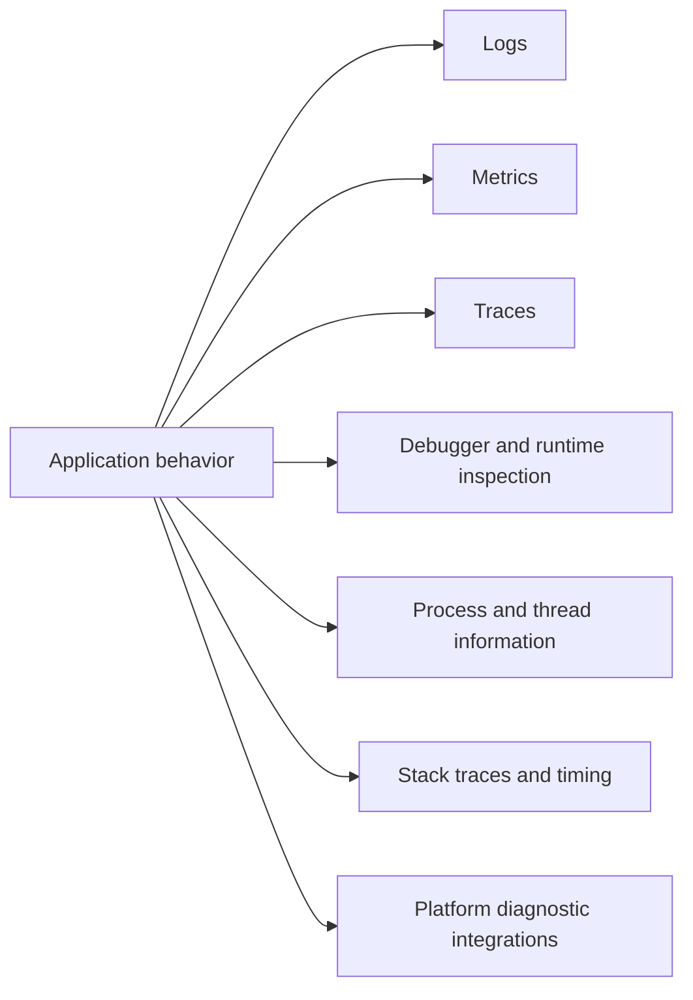

# Logging, Diagnostics, and Observability

.NET includes APIs and tools for understanding what a program is doing while it runs. Logging, metrics, traces, dumps, counters, and analyzers help you diagnose behavior that cannot be understood from source code alone.

Original Microsoft Learn references: [Logging in .NET](https://learn.microsoft.com/en-us/dotnet/core/extensions/logging) and [.NET diagnostics](https://learn.microsoft.com/en-us/dotnet/core/diagnostics/).

## A practical mental model



## Key ideas

- Logging records meaningful application events.
- Metrics measure numeric behavior over time.
- Tracing follows operations across async calls and process boundaries.
- Diagnostic tools can inspect CPU, memory, exceptions, counters, and dumps.
- Code analyzers find problems before runtime.

This chapter also includes some of the classic runtime diagnostics APIs that help you inspect the current process, measure code paths, or connect to platform-level tooling.

## Why observability matters

Source code explains intended behavior. Observability helps explain actual behavior in real execution.

That difference matters whenever the problem depends on:

- input data
- environment differences
- concurrency timing
- production load
- external services or network failures

## Example

```csharp
using Microsoft.Extensions.Logging;

ILogger logger = LoggerFactory
    .Create(builder => builder.AddConsole())
    .CreateLogger("Demo");

logger.LogInformation("Processed {Count} records", 42);
```

Structured log values are easier to query than one long formatted string.

## Logging, metrics, and traces are not the whole story

Modern observability often focuses on logs, metrics, and traces, and that focus is useful. But diagnostics in .NET is broader than observability infrastructure alone.

Sometimes you need to answer questions such as:

- What process is this code running in?
- Which thread or task is involved in the failure?
- What call stack led here?
- How long did this operation take?
- Can this information be surfaced to OS-level tools?

Those questions lead you toward debugger features and runtime diagnostic APIs.

## Debugger integration

Debuggers let you pause execution, inspect state, step through code, evaluate expressions, and examine call stacks. Even when you rely heavily on logging, a debugger is often the fastest way to understand a local defect.

In .NET, debugger-aware diagnostics also appear in code through types such as `Debugger`, `DebuggerDisplayAttribute`, and `Debugger.Break()`.

```csharp
using System.Diagnostics;

if (!Debugger.IsAttached)
{
    Console.WriteLine("Debugger is not attached.");
}
```

That kind of check is most useful in tooling, demos, or debugging helpers. It is usually not something application business logic should depend on.

Debugger integration is about making live inspection easier, not about replacing sound logging or tests.

## Processes and process threads

The `Process` API gives information about running processes and, in many cases, lets code start or inspect other processes.

```csharp
using System.Diagnostics;

Process current = Process.GetCurrentProcess();

Console.WriteLine(current.ProcessName);
Console.WriteLine(current.Id);
Console.WriteLine(current.StartTime);
```

This becomes useful when you need to understand resource usage, inspect child tools, work with external executables, or collect diagnostic context.

Process information often includes:

- process ID
- start time
- working set or memory figures
- total processor time
- loaded modules, depending on permissions and platform

The related `ProcessThread` information helps you inspect threads that belong to a process.

```csharp
using System.Diagnostics;

Process current = Process.GetCurrentProcess();

foreach (ProcessThread thread in current.Threads)
{
    Console.WriteLine($"Thread {thread.Id}: {thread.ThreadState}");
}
```

That is primarily diagnostic code. Most application logic should not manage raw process threads directly, but understanding that this information exists helps when debugging hangs, thread explosions, or unusual CPU behavior.

## Stack traces and stack frames

A stack trace shows the chain of method calls that led to the current point or to an exception. This is one of the most valuable diagnostic tools because it explains control flow after something has already gone wrong.

```csharp
using System.Diagnostics;

StackTrace trace = new(true);
Console.WriteLine(trace);
```

The `true` argument asks for file information when it is available, which often depends on debug symbols.

`StackFrame` lets you inspect individual frames.

```csharp
using System.Diagnostics;

StackTrace trace = new();
StackFrame? frame = trace.GetFrame(0);

Console.WriteLine(frame?.GetMethod()?.Name);
```

This can be useful in diagnostics helpers, but it should not become normal control-flow logic. Code that depends on stack inspection for ordinary behavior is often brittle.

## Measuring execution with `Stopwatch`

`Stopwatch` is the standard .NET type for timing code paths.

```csharp
using System.Diagnostics;

Stopwatch stopwatch = Stopwatch.StartNew();

for (int i = 0; i < 1_000_000; i++)
{
    _ = i * i;
}

stopwatch.Stop();
Console.WriteLine($"Elapsed: {stopwatch.ElapsedMilliseconds} ms");
```

This is much better than using `DateTime.Now` to measure short durations. `Stopwatch` is designed for elapsed-time measurement.

It is useful for:

- checking whether an operation is obviously too slow
- comparing alternative implementations at a basic level
- adding lightweight timing diagnostics around important operations

It is not a substitute for rigorous benchmarking. For serious performance work, microbenchmark tools such as BenchmarkDotNet are usually the better choice.

## Event logs

On Windows, applications can write to the Windows Event Log through APIs such as `EventLog`. This is useful in system administration, background services, and environments where OS-level logging integration matters.

```csharp
using System.Diagnostics;

if (OperatingSystem.IsWindows())
{
    Console.WriteLine("Windows Event Log integration is available on this platform.");
}
```

The most important beginner lesson is that event logs are platform-specific operational infrastructure. They are not the default logging destination for every .NET application.

If you target Windows services or enterprise environments, they may matter a lot. If you build cross-platform apps, you should treat them as one platform-specific option rather than the center of your logging design.

## Performance counters

Performance counters are another Windows-oriented diagnostics feature. They expose named measurements that system tools can inspect.

Historically, performance counters were important for server monitoring and Windows administration. In modern cross-platform .NET systems, they are less central than metrics systems such as OpenTelemetry or runtime counters, but they are still worth recognizing if you read older material or support older environments.

The key idea is that performance counters belong to operating-system and infrastructure monitoring, not everyday application-domain logic.

## Cross-platform diagnostics versus platform-specific diagnostics

It helps to separate diagnostics into two large buckets.

Cross-platform diagnostics often include:

- structured application logs
- traces and metrics
- `Stopwatch`
- exception stack traces
- process inspection APIs that work across major platforms

Platform-specific diagnostics may include:

- Windows Event Log
- performance counters
- platform-specific profiling or OS tools

That distinction matters because repository guidance should teach the platform-neutral core first, then explain when a Windows-specific API is still relevant.

## A worked example

```csharp
using System.Diagnostics;

Stopwatch stopwatch = Stopwatch.StartNew();

try
{
    Process current = Process.GetCurrentProcess();
    Console.WriteLine($"Process {current.ProcessName} ({current.Id})");

    DoWork();
}
catch (Exception exception)
{
    Console.WriteLine(exception.Message);
    Console.WriteLine(exception.StackTrace);
}
finally
{
    stopwatch.Stop();
    Console.WriteLine($"Completed in {stopwatch.Elapsed}");
}

static void DoWork()
{
    throw new InvalidOperationException("Simulated failure");
}
```

This combines process context, failure information, stack trace output, and elapsed-time measurement in one small diagnostic example.

## Common mistakes

- Treating logging as the only diagnostic tool worth learning.
- Using `DateTime.Now` instead of `Stopwatch` for elapsed timing.
- Building application behavior around stack inspection rather than using it for diagnostics only.
- Assuming Windows Event Log or performance counters are cross-platform defaults.
- Mixing raw diagnostic code deeply into business logic instead of isolating it behind helpers or infrastructure.

## Practical guidance

Good observability usually means:

- log important events and context, not every tiny detail
- prefer structured data over string-only messages
- use metrics for repeated numeric signals
- use tracing for operation flow, especially across boundaries
- remember that analyzers and static diagnostics complement runtime observation rather than replacing it
- use `Stopwatch` for elapsed timing, not wall-clock timestamps
- use stack traces, process inspection, and debugger features to explain failures and runtime state
- treat Windows Event Log and performance counters as platform-specific tools, not universal defaults

## Summary

- observability helps explain what the program is actually doing during execution
- logs, metrics, traces, and diagnostic tools answer different kinds of questions
- structured logging usually provides better operational value than plain concatenated messages
- debuggers, process APIs, stack traces, and `Stopwatch` add important runtime inspection capabilities
- Windows Event Log and performance counters are relevant mainly in Windows-specific operational environments
- runtime observability and compile-time diagnostics both contribute to trustworthy systems

## Practice

Add one meaningful log message to a console program. Include a named value in the message template instead of concatenating strings.

As a second exercise, time one operation with `Stopwatch`, then trigger an exception and inspect its stack trace. Explain what each diagnostic signal tells you that the other one does not.
