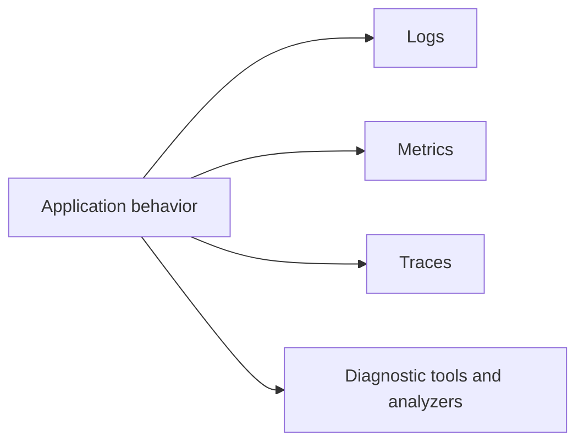

# Logging, Diagnostics, and Observability

.NET includes APIs and tools for understanding what a program is doing while it runs. Logging, metrics, traces, dumps, counters, and analyzers help you diagnose behavior that cannot be understood from source code alone.

## A practical mental model



## Key ideas

- Logging records meaningful application events.
- Metrics measure numeric behavior over time.
- Tracing follows operations across async calls and process boundaries.
- Diagnostic tools can inspect CPU, memory, exceptions, counters, and dumps.
- Code analyzers find problems before runtime.

## Why observability matters

Source code explains intended behavior. Observability helps explain actual behavior in real execution.

That difference matters whenever the problem depends on:

- input data
- environment differences
- concurrency timing
- production load
- external services or network failures

## Example

```csharp
using Microsoft.Extensions.Logging;

ILogger logger = LoggerFactory
    .Create(builder => builder.AddConsole())
    .CreateLogger("Demo");

logger.LogInformation("Processed {Count} records", 42);
```

Structured log values are easier to query than one long formatted string.

## Practical guidance

Good observability usually means:

- log important events and context, not every tiny detail
- prefer structured data over string-only messages
- use metrics for repeated numeric signals
- use tracing for operation flow, especially across boundaries
- remember that analyzers and static diagnostics complement runtime observation rather than replacing it

## Summary

- observability helps explain what the program is actually doing during execution
- logs, metrics, traces, and diagnostic tools answer different kinds of questions
- structured logging usually provides better operational value than plain concatenated messages
- runtime observability and compile-time diagnostics both contribute to trustworthy systems

## Practice

Add one meaningful log message to a console program. Include a named value in the message template instead of concatenating strings.

As a second exercise, explain which kind of signal you would choose for each case: a repeated numeric performance trend, a cross-service request flow, and a user-visible processing error.
