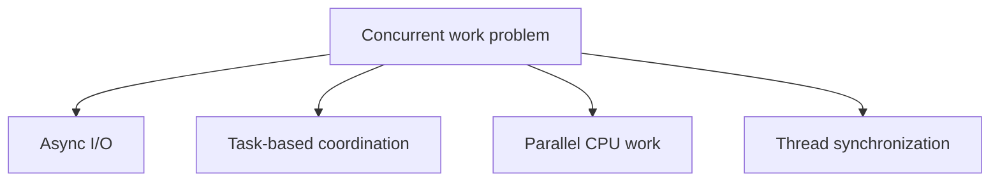

# Threading, Tasks, and Parallel Programming

.NET supports several ways to do work concurrently. C# `async` and `await` are the most common entry point, but the platform also includes threads, tasks, cancellation, timers, channels, locks, and parallel loops.

## A practical mental model



## Key ideas

- A thread is an operating-system execution path.
- A `Task` represents an asynchronous operation or scheduled work.
- `CancellationToken` communicates cooperative cancellation.
- `lock` protects shared mutable state from concurrent access.
- Parallel programming can improve throughput for CPU-bound work, but it can also add contention and complexity.

## Tasks are not threads

This is one of the most important distinctions in practical .NET concurrency.

A thread is an execution resource. A task is an abstraction representing work. The runtime decides how that work is scheduled and completed.

That is why `Task`-based code is usually the main model application developers use, even though threads still exist underneath.

## Choosing the right tool

Different concurrency problems need different tools:

- use async I/O when waiting on files, databases, or network operations
- use parallelism when independent CPU-bound work can benefit from multiple cores
- use locks or other coordination tools when shared mutable state must be protected
- use cancellation when operations may need to stop cooperatively

## Example

```csharp
using CancellationTokenSource source = new(TimeSpan.FromSeconds(5));

Task<int> work = Task.Run(() => CountItems(source.Token));
int result = await work;
```

Tasks are not the same thing as threads. A task is an abstraction for work; the runtime decides how that work is scheduled.

## Common beginner mistakes

- Using parallelism for I/O-bound work when async would be more appropriate.
- Assuming adding more concurrency always improves performance.
- Forgetting that shared state introduces synchronization problems.
- Treating cancellation as forceful termination instead of cooperative communication.

## Summary

- .NET provides multiple concurrency tools because different problems need different approaches
- tasks are the main abstraction for asynchronous work, but they are not the same as threads
- async, parallelism, locking, and cancellation solve different categories of problems
- concurrency can improve throughput, but it also adds coordination complexity

## Practice

Take a synchronous loop and identify whether it is I/O-bound or CPU-bound before deciding whether async, parallelism, or neither is appropriate.

As a second exercise, explain why a task-based API can be easier to work with than manual thread management for most application code.
