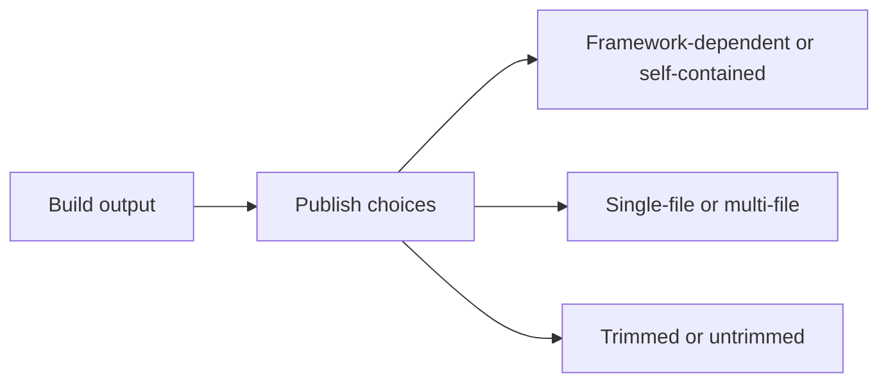

# Publishing, Deployment, and Versioning

Building creates output for development. Publishing creates output intended to run somewhere else. .NET publishing options affect size, portability, startup time, runtime requirements, and compatibility.

Original Microsoft Learn reference: [.NET application publishing overview](https://learn.microsoft.com/en-us/dotnet/core/deploying/).

## A practical mental model



## Key ideas

- Framework-dependent apps require a compatible .NET runtime on the target machine.
- Self-contained apps include the runtime with the app.
- Single-file publishing bundles output into one executable file.
- Trimming can reduce size but may affect reflection-heavy code.
- Versioning includes SDK versions, target frameworks, runtime versions, package versions, and assembly versions.

## Build versus publish

This distinction matters in real delivery workflows.

- `dotnet build` is mainly about compiling for development and verification
- `dotnet publish` prepares application output for deployment or distribution

Publishing decisions should be driven by the target environment, not by what feels easiest on the developer machine.

## Example

```bash
dotnet publish -c Release
dotnet publish -c Release --self-contained true
```

Choose publishing settings based on the environment where the program will run, not only on local convenience.

## Versioning is broader than one number

In .NET, versioning often spans several layers at once:

- SDK version used to build
- target framework of the project
- runtime version expected or bundled
- package versions in dependencies
- assembly and product version metadata

That is why deployment issues are often compatibility issues rather than simple "it built successfully" questions.

## Practical guidance

Ask these questions before publishing:

- will the target environment already have the right runtime installed
- is output size or portability the bigger priority
- does the application use reflection-heavy features that trimming could affect
- how will version consistency be controlled across development and deployment environments

## Summary

- publishing is a deployment-oriented step, not just another name for building
- framework-dependent and self-contained deployments make different tradeoffs
- single-file and trimming options can improve portability or size but may add constraints
- versioning in .NET involves SDK, runtime, target framework, package, and assembly decisions together

## Practice

Publish a small console app and compare the output of a normal framework-dependent publish with a self-contained publish.

As a second exercise, explain why a successful local build does not automatically guarantee a successful deployment environment.
