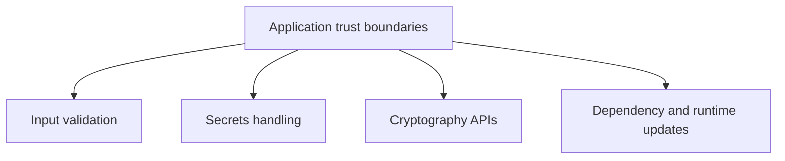

# Security, Cryptography, and Safe Code

.NET provides APIs and platform guidance for writing safer code. Security is not a single feature; it appears in input handling, secrets, cryptography, dependency updates, file access, networking, and deployment choices.

## A practical mental model



## Key ideas

- Validate and normalize input at trust boundaries.
- Do not store secrets in source code or committed configuration files.
- Prefer established cryptography APIs over custom algorithms.
- Keep packages and runtimes updated for security fixes.
- Use safe C# by default; reserve `unsafe` code for narrow, justified scenarios.

## Security is a cross-cutting concern

Security is not something added at the end by one library call. It appears throughout the application lifecycle.

That includes:

- what input the program accepts
- where configuration values come from
- how secrets are stored and loaded
- how dependencies are selected and updated
- how deployment and runtime environments are maintained

## Example

```csharp
using System.Security.Cryptography;

byte[] bytes = RandomNumberGenerator.GetBytes(32);
string token = Convert.ToBase64String(bytes);
```

Security-sensitive randomness should come from cryptographic APIs, not from `Random`.

## Practical guidance

Good baseline security habits usually mean:

- validate external input early and clearly
- keep secrets out of source control
- use standard cryptography APIs instead of inventing your own approach
- patch runtimes and packages deliberately
- prefer safer defaults over low-level risky power unless there is a justified need

## Common beginner mistakes

- Treating internal tools as if they do not need security thinking.
- Putting secrets in source code for convenience.
- Using `Random` where cryptographic randomness is required.
- Assuming safe code is only about avoiding `unsafe` blocks rather than about broader trust-boundary design.

## Summary

- security in .NET spans input handling, secrets, dependencies, cryptography, and deployment practices
- strong security usually comes from good defaults and disciplined boundaries rather than one special feature
- built-in cryptographic APIs should be preferred over custom security logic
- package and runtime maintenance are part of the security story too

## Practice

Review a small program and list every place it reads input, opens a file, loads configuration, or depends on a package. Each item is part of the program's security surface.

As a second exercise, explain why "this is only an internal tool" is not a strong reason to ignore security basics.
