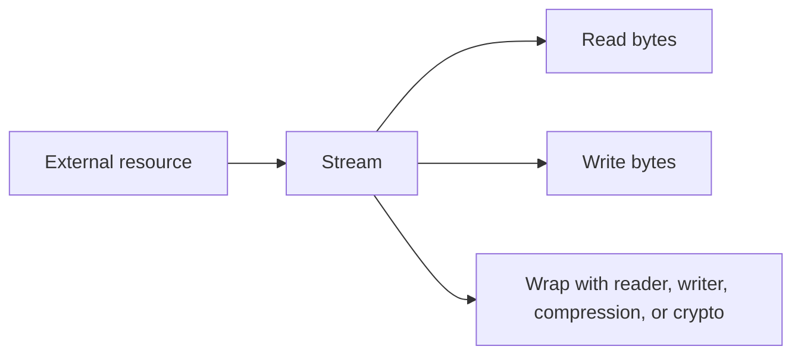

# Streams and I/O

Streams are one of the core I/O abstractions in .NET. They represent a flow of bytes between your program and some external resource such as a file, a memory buffer, a network socket, or a compressed wrapper.

This topic matters because high-level helpers such as `File.ReadAllText` are convenient, but they are built on lower-level I/O concepts. Once you understand streams, many .NET APIs start to feel connected instead of unrelated.

## A practical mental model



The stream is the pipe. Other APIs often sit on top of it.

## Why streams exist

Many kinds of I/O share the same basic shape:

- open a resource
- read data or write data
- move through the data in sequence
- close or dispose the resource

Instead of inventing a totally different model for files, memory buffers, network responses, and compression wrappers, .NET uses `Stream` as a shared abstraction.

That is why stream knowledge transfers across many parts of the platform.

## Bytes first, text second

`Stream` works with bytes. Text requires an extra layer because text depends on an encoding such as UTF-8.

That distinction is important:

- `Stream` is about raw bytes
- `StreamReader` and `StreamWriter` are about text on top of a byte stream

This helps explain why many I/O bugs are really encoding bugs rather than stream bugs.

## Common stream-related types

The .NET I/O stack is easier to reason about if you separate the roles:

- `Stream` is the base abstraction
- `FileStream` connects a stream to a file
- `MemoryStream` keeps data in memory
- `StreamReader` reads text from a stream
- `StreamWriter` writes text to a stream
- `BinaryReader` and `BinaryWriter` read and write primitive binary values
- wrapper streams such as compression or crypto streams transform data as it flows through

## A simple `FileStream` example

```csharp
using FileStream stream = File.OpenRead("notes.txt");

byte[] buffer = new byte[128];
int bytesRead = stream.Read(buffer, 0, buffer.Length);

Console.WriteLine($"Read {bytesRead} bytes.");
```

This example is deliberately low-level. It shows that a stream is not automatically text. It is just a sequence of bytes.

## Reading text with `StreamReader`

In everyday application code, text is common enough that you usually add a reader on top of the stream.

```csharp
using FileStream fileStream = File.OpenRead("notes.txt");
using StreamReader reader = new(fileStream);

string content = reader.ReadToEnd();
Console.WriteLine(content);
```

This is often easier to understand than working with raw byte buffers when the data is clearly textual.

## Writing text with `StreamWriter`

```csharp
using FileStream fileStream = File.Create("output.txt");
using StreamWriter writer = new(fileStream);

writer.WriteLine("Hello from StreamWriter");
writer.WriteLine("Streams can be wrapped with text APIs.");
```

The writer handles encoding details for normal text output.

## Why `using` matters for I/O

Streams often hold external resources such as file handles. Those resources should be released promptly instead of waiting for garbage collection.

That is why `using` and `await using` matter so much in I/O-heavy code.

```csharp
using FileStream stream = File.OpenRead("data.bin");
```

The point is not only syntax convenience. It is deterministic cleanup.

## Synchronous versus asynchronous I/O

I/O often waits on the operating system, disk, or network. Because of that, stream APIs commonly offer both synchronous and asynchronous forms.

```csharp
using FileStream stream = File.OpenRead("notes.txt");
byte[] buffer = new byte[1024];

int bytesRead = await stream.ReadAsync(buffer);
```

Use asynchronous I/O when waiting efficiently matters, especially in servers, UI apps, and high-concurrency code.

That ties streams directly back to your async lessons: async is often about waiting on I/O, and streams are a major source of that waiting.

## Buffering and throughput

I/O usually benefits from buffering because external resources are much slower than CPU and memory operations.

You do not always manage buffering manually, but you should understand the idea:

- larger operations are often more efficient than tiny repeated ones
- wrapper APIs may buffer internally
- flushing writes too often can reduce throughput

Performance tuning comes later, but the concept belongs here.

## Paths, files, and streams are related but different

It helps to keep these concepts separate:

- `Path` helps construct or inspect path strings
- `File` and `Directory` provide high-level convenience methods
- `Stream` is the lower-level I/O abstraction underneath many operations

That means `File.ReadAllText` and `StreamReader` are not competing ideas. They are different levels of abstraction.

## A worked example

```csharp
string path = Path.Combine(Environment.CurrentDirectory, "log.txt");

await using FileStream stream = File.Create(path);
await using StreamWriter writer = new(stream);

await writer.WriteLineAsync("Application started");
await writer.WriteLineAsync($"Started at {DateTime.UtcNow:O}");
```

This example combines path handling, file creation, asynchronous disposal, and text writing on top of a stream.

## Common mistakes

- Treating streams as if they automatically mean text instead of bytes.
- Forgetting to dispose streams promptly.
- Reading or writing tiny chunks repeatedly without understanding buffering costs.
- Mixing synchronous and asynchronous I/O carelessly in larger applications.
- Assuming stream position always starts where you expect without checking how the stream was opened or reused.

## Summary

- `Stream` is the shared .NET abstraction for byte-oriented I/O
- text I/O usually uses `StreamReader` and `StreamWriter` on top of a stream
- files, memory buffers, compression, and network I/O often share the same stream model
- deterministic cleanup with `using` matters because streams hold external resources
- asynchronous stream APIs are a major bridge between I/O and async programming

## Practice

Write one example that reads text from a file by using `File.ReadAllText`, then rewrite it by using `FileStream` and `StreamReader`. Explain what extra concept the second version teaches.

As a second exercise, write a short note explaining the difference between bytes, text, and encoding in the context of streams.
