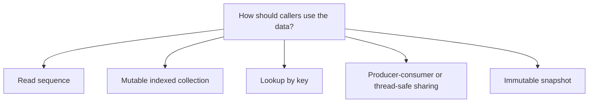

# Collection Interfaces and Specialized Collections

.NET collections are more than `List<T>` and `Dictionary<TKey, TValue>`. The platform also defines common collection interfaces and specialized collection types for ordering, uniqueness, coordination, thread safety, and immutability.

This topic matters because good collection design is often less about memorizing types and more about matching the API contract to the way data should be used.

## A practical mental model



The collection choice should communicate allowed operations, not just storage.

## Why interfaces matter

Collection interfaces let APIs describe behavior without committing to one concrete implementation.

For example:

- `IEnumerable<T>` means callers can enumerate values
- `ICollection<T>` adds collection semantics such as count and mutation support
- `IList<T>` adds indexed access
- `IReadOnlyList<T>` exposes indexed reads without promising mutation
- `IDictionary<TKey, TValue>` models key-value lookup
- `IReadOnlyDictionary<TKey, TValue>` exposes lookup without promising writes

This matters because public APIs should usually expose the least powerful contract that still matches real needs.

## `IEnumerable<T>` is the baseline sequence contract

If callers only need to iterate, `IEnumerable<T>` is often enough.

```csharp
static void PrintAll(IEnumerable<string> values)
{
    foreach (string value in values)
    {
        Console.WriteLine(value);
    }
}
```

This keeps the method flexible. The caller can pass an array, list, hash set, LINQ query, or many other sequence types.

## Read-only interfaces communicate intent

If code should expose data without allowing outside mutation, read-only interfaces often express that intent better than concrete mutable types.

```csharp
public IReadOnlyList<string> GetSteps()
{
    return _steps;
}
```

This does not make the underlying object magically immutable, but it does make the public contract clearer.

That difference between implementation and API surface is important.

## Queue and stack

Some collections exist because processing order matters.

Use `Queue<T>` for first-in, first-out behavior:

```csharp
Queue<string> jobs = new();
jobs.Enqueue("import");
jobs.Enqueue("validate");

Console.WriteLine(jobs.Dequeue());
```

Use `Stack<T>` for last-in, first-out behavior:

```csharp
Stack<string> navigation = new();
navigation.Push("Home");
navigation.Push("Details");

Console.WriteLine(navigation.Pop());
```

These are not just different containers. They represent different processing rules.

## Concurrent collections

Normal collections such as `List<T>` and `Dictionary<TKey, TValue>` are not automatically safe for unsynchronized concurrent mutation from multiple threads.

For producer-consumer or multi-threaded coordination, .NET provides concurrent collections such as:

- `ConcurrentDictionary<TKey, TValue>`
- `ConcurrentQueue<T>`
- `ConcurrentStack<T>`
- `BlockingCollection<T>`

Example:

```csharp
using System.Collections.Concurrent;

ConcurrentQueue<string> workItems = new();
workItems.Enqueue("task-1");

if (workItems.TryDequeue(out string? item))
{
    Console.WriteLine(item);
}
```

These types help reduce manual locking for common coordination scenarios, though they do not remove the need to understand concurrency.

## Immutable collections

Sometimes the main goal is not efficient mutation but safe sharing and predictable snapshots.

Immutable collections are useful when:

- data should not change after publication
- state transitions should produce a new collection rather than mutate the existing one
- callers should safely share data without worrying about later mutation

Example shape:

```csharp
using System.Collections.Immutable;

ImmutableList<string> names = ImmutableList<string>.Empty;
names = names.Add("Ava");
names = names.Add("Noah");
```

Notice the pattern: methods return a new collection value instead of mutating the existing one in place.

That can feel unusual at first, but it often simplifies reasoning about shared state.

## Choosing concrete collections versus interfaces

Use concrete types when you are implementing storage or when the specific behavior matters directly.

Use interfaces when you are expressing what consumers of an API should be able to do.

For example:

- a private field may be `List<T>`
- a public return type may be `IReadOnlyList<T>`

That pattern lets the implementation stay practical while the API stays disciplined.

## A worked example

```csharp
private readonly List<string> _messages = new();

public IReadOnlyList<string> Messages => _messages;

public void AddMessage(string message)
{
    _messages.Add(message);
}
```

This is a common design compromise:

- use a simple mutable collection internally
- expose a narrower read-only contract externally

## Common mistakes

- Returning `List<T>` from APIs when callers only need read access.
- Assuming all collections are interchangeable because they are generic.
- Using `List<T>` for queue or stack behavior instead of using the dedicated type that expresses intent.
- Treating concurrent collections as a replacement for concurrency reasoning.
- Confusing read-only interfaces with true immutability.

## Summary

- collection interfaces describe what callers can do, not only how data is stored
- `IEnumerable<T>` is the basic sequence contract and `IReadOnly*` interfaces help narrow public APIs
- queue and stack types exist because processing order matters
- concurrent collections help with multi-threaded coordination scenarios
- immutable collections help model safe shared data and snapshot-style state

## Practice

Take one API that currently returns `List<T>` and decide whether `IEnumerable<T>`, `IReadOnlyList<T>`, or `IReadOnlyDictionary<TKey, TValue>` would express the real contract more accurately.

As a second exercise, explain when you would choose `ConcurrentQueue<T>` over `Queue<T>`, and when you would choose an immutable collection instead of either one.
