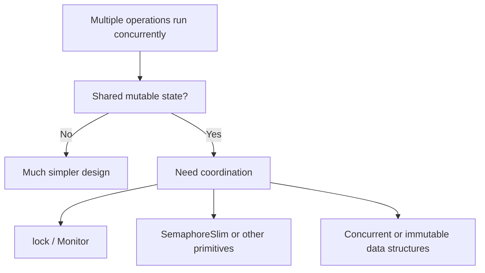

# Synchronization and Shared State

Concurrency becomes harder when multiple execution paths can touch the same mutable data. At that point, the main problem is no longer only "how do I start more work?" It becomes "how do I coordinate access safely?"

This topic matters because many threading bugs are not obvious syntax problems. They are timing problems: race conditions, deadlocks, lost updates, and state that looks correct in one run but breaks in another.

## A practical mental model



The easiest shared-state bug is the one you never create.

## Race conditions

A race condition happens when correctness depends on timing between operations.

For example, two threads reading and updating the same value can interfere with each other:

```csharp
int counter = 0;

counter++;
```

That line looks simple, but increment is not a magical indivisible concept. It involves reading, changing, and writing. If multiple operations do that concurrently without coordination, results can be wrong.

## `lock` protects critical sections

The most common coordination primitive for shared in-process mutable state is `lock`.

```csharp
private readonly object _gate = new();
private int _count;

public void Increment()
{
    lock (_gate)
    {
        _count++;
    }
}
```

The lock says only one thread at a time may execute that critical section for that shared gate object.

This is simple and useful, but it should be kept tight and deliberate.

## Keep critical sections small

When using synchronization primitives, shorter critical sections are usually easier to reason about and less likely to cause contention.

Good practice usually means:

- protect only the shared state that really needs coordination
- avoid long-running or blocking work while holding a lock
- avoid mixing unrelated state under one big lock when clearer boundaries exist

## `SemaphoreSlim` for limited concurrency

`SemaphoreSlim` is useful when you want to allow a limited number of concurrent operations rather than exactly one.

```csharp
SemaphoreSlim gate = new(2);

await gate.WaitAsync();
try
{
    await Task.Delay(500);
}
finally
{
    gate.Release();
}
```

This is common when throttling access to a scarce resource such as outbound requests or expensive background work.

## Prefer design that reduces shared mutation

The cleanest concurrency design often comes from reducing shared mutable state rather than adding more locks.

Common strategies include:

- passing data inward instead of sharing one mutable object globally
- using immutable values for published state
- using message passing or queues instead of direct shared mutation
- isolating state ownership to one component or worker

This is one reason concurrent collections and immutable collections matter: they can simplify coordination boundaries.

## Deadlocks and contention

Synchronization can solve races, but it can introduce its own problems.

- Deadlock happens when execution paths wait on each other and nothing can proceed.
- Contention happens when many operations compete for the same protected resource.

That is why synchronization primitives are helpful but not free.

## A worked example

```csharp
public sealed class Counter
{
    private readonly object _gate = new();
    private int _value;

    public void Increment()
    {
        lock (_gate)
        {
            _value++;
        }
    }

    public int Read()
    {
        lock (_gate)
        {
            return _value;
        }
    }
}
```

This is intentionally small, but it teaches the essential pattern:

- one object owns the state
- one gate protects that state
- callers do not manipulate the field directly

## Common mistakes

- Assuming `Task`-based code automatically avoids shared-state problems.
- Locking on publicly accessible objects or on `this`.
- Holding a lock while doing long-running I/O or waiting work.
- Adding synchronization everywhere instead of redesigning ownership and mutation boundaries.
- Thinking thread-safe collections remove all concurrency design concerns.

## Summary

- threading problems usually become difficult when mutable state is shared
- `lock` protects critical sections for one-at-a-time access
- `SemaphoreSlim` is useful for limited-concurrency coordination
- deadlocks and contention are real costs of synchronization
- reducing shared mutable state is often better than adding more locking

## Practice

Take one mutable shared value in a sample design and explain whether it should be protected by `lock`, moved behind a queue, or replaced with an immutable publication model.

As a second exercise, explain why `counter++` is not safe to assume in a concurrent shared-state scenario.
