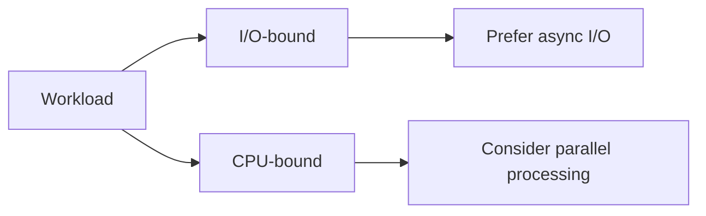

# Parallel Processing and Data Parallelism

Parallel programming is about doing independent CPU-bound work across multiple cores. This is different from async I/O, where the main benefit usually comes from not blocking while waiting on external resources.

This topic matters because many developers first learn `async` and then assume it covers all concurrency. It does not. Parallelism is mainly about throughput for computation, not about waiting efficiently on I/O.

## A practical mental model



The first design question is usually whether the bottleneck is waiting or computing.

## When parallelism helps

Parallel processing can help when:

- units of work are independent
- the work is meaningfully CPU-bound
- there is enough work to justify scheduling overhead
- the machine has multiple cores available

Examples include image processing, large numerical transformations, independent file parsing after loading, and batch-style computation.

## `Parallel.For` and `Parallel.ForEach`

The simplest entry points are often `Parallel.For` and `Parallel.ForEach`.

```csharp
using System.Threading.Tasks;

int[] numbers = Enumerable.Range(1, 10).ToArray();

Parallel.ForEach(numbers, number =>
{
    double result = Math.Sqrt(number);
    Console.WriteLine($"{number} -> {result}");
});
```

This expresses that each iteration can run independently.

That independence is the key requirement. If iterations constantly coordinate or mutate shared state, the benefit often disappears.

## Parallelism is not free

Parallel work adds overhead:

- scheduling work
- coordinating completion
- merging results
- handling contention on shared resources

That means small or tightly coupled workloads may become slower rather than faster.

## Avoid shared mutable state in parallel loops

This is one of the biggest practical rules.

Problematic shape:

```csharp
int total = 0;

Parallel.ForEach(numbers, number =>
{
    total += number;
});
```

This introduces a race on shared state.

Safer designs usually mean:

- using thread-safe aggregation patterns
- returning results and combining them afterward
- using PLINQ or other APIs built for parallel data processing

## PLINQ

PLINQ extends LINQ with parallel execution for suitable in-memory query workloads.

```csharp
using System.Linq;

int[] squares = Enumerable.Range(1, 1000)
    .AsParallel()
    .Select(n => n * n)
    .ToArray();
```

This can be useful when a LINQ-style transformation is CPU-heavy and parallel-friendly.

But the same warning still applies: not every query benefits from parallelism.

## Cancellation and degree of parallelism

Parallel workloads often need operational controls:

- cancellation, so work can stop cooperatively
- max degree of parallelism, so the program does not oversubscribe resources

This is another reason parallel programming belongs in runtime/platform knowledge, not only in language syntax.

## Parallelism versus concurrency more broadly

It helps to keep the terms distinct:

- concurrency means multiple operations can make progress in overlapping time
- parallelism means multiple operations are actually executing computation at the same time on multiple cores

Async I/O gives concurrency without necessarily adding parallel CPU execution.

## A worked example

```csharp
string[] lines = File.ReadAllLines("numbers.txt");

double[] values = lines
    .AsParallel()
    .Select(line => double.Parse(line) * Math.PI)
    .ToArray();
```

This example is intentionally split into phases:

- file I/O happens first
- CPU-bound parsing and transformation happen next

That split is a useful design clue. Use async or regular I/O for the file access, then consider parallelism for the computation if the workload is large enough.

## Common mistakes

- Using parallel loops for I/O-bound work that mainly waits.
- Assuming more parallelism always means better performance.
- Mutating shared state inside parallel work without proper coordination.
- Applying PLINQ to tiny or trivial queries where overhead dominates.
- Forgetting that result ordering and determinism may matter to callers.

## Summary

- parallel programming is mainly about CPU-bound work across multiple cores
- async I/O and parallel CPU work solve different performance problems
- `Parallel.ForEach` and PLINQ are useful tools when work units are independent
- shared mutable state can quickly erase parallelism benefits or introduce correctness bugs
- measuring real workloads matters more than assuming parallelism will help

## Practice

Take one operation and classify it as I/O-bound or CPU-bound. Then explain whether async, parallelism, both in phases, or neither is the better design.

As a second exercise, write a short explanation of why `AsParallel()` is not automatically a performance improvement for every LINQ query.
