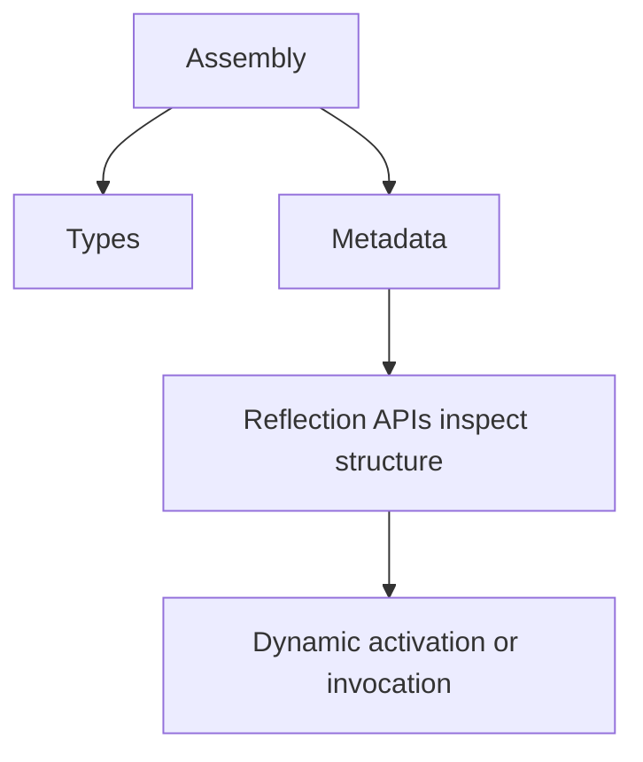
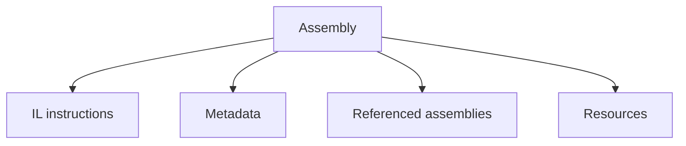

# Assemblies, Reflection, and Metadata

Assemblies are the compiled deployment units that hold .NET code and metadata. Reflection is the runtime API that lets programs inspect that metadata and interact with types dynamically.

Original Microsoft Learn references: [Assemblies in .NET](https://learn.microsoft.com/en-us/dotnet/standard/assembly/) and [Reflection and attributes](https://learn.microsoft.com/en-us/dotnet/csharp/advanced-topics/reflection-and-attributes/).

These ideas matter because they explain how plugins load, how serializers inspect types, how dependency injection containers discover services, and how many tools understand code without hard-coding every concrete type.

## A practical mental model



## What an assembly contains

An assembly usually contains:

- compiled intermediate language
- metadata that describes types and members
- references to other assemblies
- optional embedded resources

That is why an assembly is more than a blob of machine instructions. The runtime and tooling can inspect its structure.

## Inspecting the current assembly

```csharp
using System.Reflection;

Assembly assembly = Assembly.GetExecutingAssembly();

Console.WriteLine(assembly.GetName().Name);
Console.WriteLine(assembly.Location);
```

This is often the first reflection step: get an assembly object, then examine what it contains.

## Discovering types

```csharp
using System.Reflection;

Assembly assembly = Assembly.GetExecutingAssembly();
Type[] types = assembly.GetTypes();

foreach (Type type in types)
{
    Console.WriteLine(type.FullName);
}
```

That kind of enumeration is common in frameworks that scan for handlers, controllers, commands, or plugins.

## Inspecting members

```csharp
Type productType = typeof(Product);

foreach (PropertyInfo property in productType.GetProperties())
{
    Console.WriteLine($"{property.Name}: {property.PropertyType.Name}");
}

public sealed record Product(int Id, string Name);
```

Reflection can inspect fields, properties, methods, constructors, attributes, and more.

## Activating a type dynamically

```csharp
Type type = typeof(ProductService);
object? instance = Activator.CreateInstance(type);

public sealed class ProductService
{
}
```

Dynamic activation is powerful, but it should be used carefully. Compile-time construction is usually simpler and safer when the concrete type is already known.

## Reading attributes

Attributes are metadata attached to program elements, and reflection is how you usually read them.

```csharp
using System.Reflection;

[Obsolete("Use NewProcessor instead.")]
public sealed class LegacyProcessor
{
}

Type legacyType = typeof(LegacyProcessor);
ObsoleteAttribute? attribute = legacyType.GetCustomAttribute<ObsoleteAttribute>();

Console.WriteLine(attribute?.Message);
```

This pattern appears everywhere in .NET infrastructure.

## Common uses of reflection

Reflection is commonly used for:

- serializers and mappers
- plugin systems
- test discovery
- dependency injection and framework bootstrapping
- analyzers, code generators, and runtime inspection tools

The point is not that every application should use reflection heavily. The point is that many frameworks you use are already built on top of it.

## Reflection has costs

Reflection is flexible, but it also has tradeoffs:

- slower than direct compile-time access
- easier to break during refactoring if you depend on raw strings
- more complex to secure and validate when loading unknown code
- harder to reason about than explicit code paths

That is why reflection should solve a real runtime-discovery problem, not replace normal design.

## Loading assemblies

Assemblies can also be loaded dynamically, which is useful for plugin or extensibility systems.

```csharp
using System.Reflection;

Assembly assembly = Assembly.Load("System.Text.Json");
Console.WriteLine(assembly.FullName);
```

Loading and resolving assemblies is more advanced than simple inspection, but it belongs to the same conceptual area.

## Practical guidance

- Learn assemblies as the runtime unit that packages code and metadata together.
- Use reflection when the program genuinely must discover types or members at runtime.
- Prefer `typeof`, `nameof`, and strongly typed APIs over raw member-name strings when possible.
- Be cautious when dynamically loading or activating unknown code.

## Summary

- assemblies package compiled code together with metadata and references
- reflection lets .NET code inspect and sometimes use that metadata dynamically
- many framework features depend on reflection even when application code does not call it directly
- reflection is powerful, but it trades simplicity and some performance for runtime flexibility

## Practice

Write code that lists all public properties on one of your own types.

As a second exercise, inspect a custom attribute with reflection and explain what makes attributes useful as metadata instead of ordinary comments.# Assemblies, Reflection, and Metadata

Assemblies are one of the core packaging and runtime units in .NET. Reflection is the ability to inspect types, members, and metadata at runtime. These ideas belong together because reflection works by reading the information assemblies carry about the code they contain.

This topic matters because many parts of .NET depend on metadata-driven behavior: dependency injection, serialization, test discovery, plugin loading, analyzers, and many frameworks that scan assemblies for types or attributes.

## Start with assemblies

An assembly is a compiled .NET output such as a `.dll` or `.exe`. It contains:

- intermediate language
- metadata about types and members
- references to other assemblies
- optional embedded resources



That metadata is one of the reasons .NET tooling is so capable. The runtime and other libraries can inspect code structure without seeing the original source files.

## Why metadata matters

Metadata describes things such as:

- type names and namespaces
- method signatures
- property definitions
- custom attributes
- generic parameters

Without metadata, reflection would have almost nothing to inspect.

## Loading assemblies conceptually

When your application starts, the runtime loads assemblies and resolves dependencies. Sometimes code also loads assemblies dynamically, such as in plugin systems or infrastructure libraries.

That is powerful, but dynamic loading should be used carefully because it introduces versioning, isolation, and security questions.

## Basic reflection on a type

```csharp
Type type = typeof(StringBuilder);

Console.WriteLine(type.FullName);
Console.WriteLine(type.IsClass);
Console.WriteLine(type.Assembly.GetName().Name);
```

Reflection begins with `Type`. Once you have a `Type` object, you can inspect constructors, methods, properties, fields, interfaces, and attributes.

## Inspecting members

```csharp
Type type = typeof(DateTime);

foreach (var property in type.GetProperties())
{
    Console.WriteLine(property.Name);
}
```

This is useful in frameworks and tooling, but even ordinary application developers should understand what is happening when a library says it is "scanning types" or "reading attributes."

## Reading attributes with reflection

```csharp
[AttributeUsage(AttributeTargets.Class)]
public sealed class DemoAttribute : Attribute
{
    public string Name { get; }

    public DemoAttribute(string name)
    {
        Name = name;
    }
}

[Demo("Sample")]
public sealed class Example
{
}

Type type = typeof(Example);
DemoAttribute? attribute = type.GetCustomAttributes(typeof(DemoAttribute), inherit: false)
    .Cast<DemoAttribute>()
    .FirstOrDefault();

Console.WriteLine(attribute?.Name);
```

This pattern is common in framework extensibility.

## Creating objects dynamically

Reflection can also activate types dynamically.

```csharp
Type listType = typeof(List<int>);
object? instance = Activator.CreateInstance(listType);

Console.WriteLine(instance?.GetType().Name);
```

This is useful in infrastructure code, but it should not replace normal construction in ordinary application logic unless there is a good reason.

## Reflection is powerful but not free

Reflection adds tradeoffs:

- code becomes more indirect
- some errors move from compile time to runtime
- performance may be slower than direct calls
- trimming and ahead-of-time scenarios may require extra care

That does not make reflection bad. It means it should be used where the flexibility is worth the cost.

## Strong names and signing at a high level

Assemblies can also carry identity and signing information. Strong names and signing are assembly-level concerns related to identity, trust boundaries, packaging, and deployment. Most beginners do not need to apply them immediately, but they should know assembly identity is more than just a file name.

## A practical example

```csharp
using System.Reflection;
using System.Text;

Assembly assembly = typeof(StringBuilder).Assembly;

Console.WriteLine(assembly.GetName().Name);

foreach (Type exportedType in assembly.GetExportedTypes().Take(5))
{
    Console.WriteLine(exportedType.FullName);
}
```

This demonstrates the connection between an assembly and the types it exposes.

## When reflection is a good fit

Reflection is often appropriate for:

- plugin discovery
- custom serializers and mappers
- test or command discovery
- analyzers and tooling
- frameworks that use attributes for configuration

It is usually not the best first choice for normal business logic that could be expressed directly in types and interfaces.

## Common mistakes

- Using reflection where normal interfaces or generics would be simpler.
- Assuming reflection-based code is always harmless in trimmed or AOT deployments.
- Hiding important design decisions behind string-based type names.
- Forgetting that runtime activation moves many failures later.

## Practical guidance

- Understand assemblies as the units that package IL and metadata.
- Use reflection when you need runtime flexibility, discovery, or metadata-driven behavior.
- Prefer direct type usage when the set of behaviors is already known at compile time.
- Treat dynamic loading and activation as advanced tools that need careful design.

## Summary

- assemblies package compiled code, metadata, references, and resources
- reflection reads and sometimes acts on that metadata at runtime
- `Type`, `Assembly`, attributes, and `Activator` are central reflection tools
- many frameworks rely on reflection, even when your own code does not use it directly
- reflection is powerful, but it trades some simplicity and compile-time safety for flexibility

## Practice

Use reflection to print the public properties of a type from the base class library.

As a second exercise, write a short note explaining why dependency injection containers and serializers often depend on metadata and reflection.
