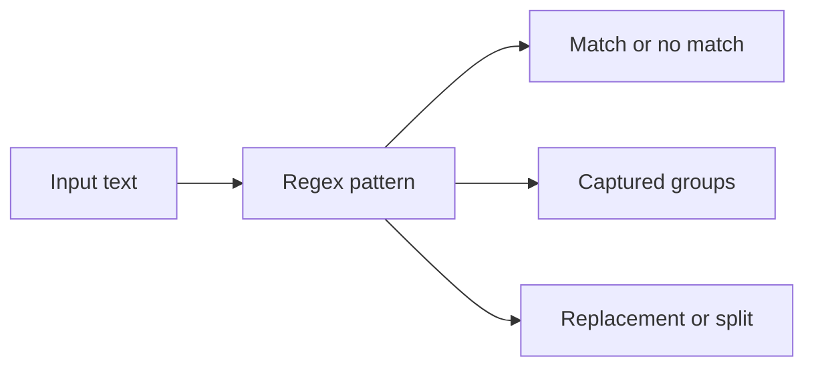
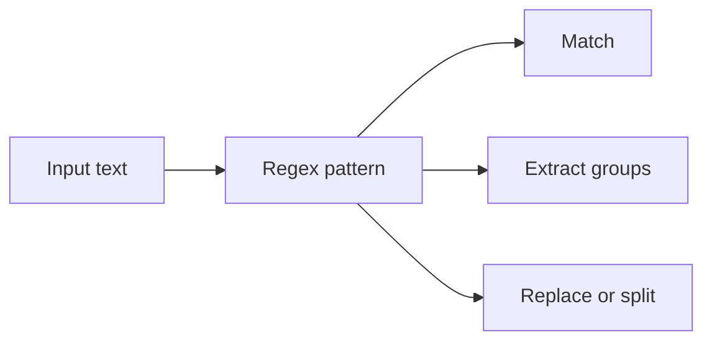

# Regular Expressions

Regular expressions are a compact language for matching and transforming text. In .NET they live primarily in the `Regex` API under `System.Text.RegularExpressions`.

Original Microsoft Learn reference: [Regular expressions in .NET](https://learn.microsoft.com/en-us/dotnet/standard/base-types/regular-expressions).

This topic matters because text validation and extraction appear everywhere: logs, user input, file names, IDs, commands, parsing helpers, search tools, and migration scripts. Regular expressions are powerful, but they become dangerous when used where clearer string logic would be easier to understand.

## A practical mental model

Think of a regular expression as a pattern that describes text shape.



## A simple match

```csharp
using System.Text.RegularExpressions;

Regex regex = new(@"\d+");
Match match = regex.Match("Order 4521 created");

Console.WriteLine(match.Value);
```

This pattern matches one or more digits.

## Core building blocks

Some common regex pieces are:

- `.` any character except newline in many modes
- `\d` a digit
- `\w` a word character
- `\s` whitespace
- `+` one or more
- `*` zero or more
- `?` optional or lazy modifier depending on context
- `^` start of input or line
- `$` end of input or line

These are powerful because they compose. For example:

```text
^\d{4}-\d{2}-\d{2}$
```

This matches a simple date-like shape such as `2026-06-06`.

## Validation example

```csharp
using System.Text.RegularExpressions;

bool isValid = Regex.IsMatch("2026-06-06", @"^\d{4}-\d{2}-\d{2}$");
Console.WriteLine(isValid);
```

That checks text shape, not calendar correctness. A regex can tell you whether the input looks like a date, but not whether the date is semantically valid. That distinction matters.

## Capturing groups

Groups let you extract specific parts of matched text.

```csharp
using System.Text.RegularExpressions;

Regex regex = new(@"^(\d{4})-(\d{2})-(\d{2})$");
Match match = regex.Match("2026-06-06");

if (match.Success)
{
    Console.WriteLine(match.Groups[1].Value);
    Console.WriteLine(match.Groups[2].Value);
    Console.WriteLine(match.Groups[3].Value);
}
```

Named groups are often clearer than numeric groups.

```csharp
Regex named = new(@"^(?<year>\d{4})-(?<month>\d{2})-(?<day>\d{2})$");
```

## Replacing text

Regex is not only for matching. It can also rewrite text.

```csharp
using System.Text.RegularExpressions;

string normalized = Regex.Replace("Order-4521", @"[^a-zA-Z0-9]", "_");
Console.WriteLine(normalized);
```

This kind of cleanup appears often in slug generation, normalization, and migration utilities.

## Splitting text

```csharp
using System.Text.RegularExpressions;

string[] parts = Regex.Split("red, green; blue", @"[,;]\s*");
Console.WriteLine(string.Join(" | ", parts));
```

That is useful when separators vary.

## Compiled and generated regex support

.NET offers several ways to create regex patterns, including generated regex support for high-performance and strongly declared scenarios. The important beginner lesson is not the optimization detail, but the design principle: keep patterns readable and tested before optimizing them.

## When regex is the wrong tool

Regular expressions are often overused.

Prefer normal string logic when:

- the rule is simple enough for `StartsWith`, `Contains`, `Split`, or `Replace`
- you need full semantic parsing, not just text shape
- the regex would be so dense that the next reader cannot maintain it confidently

For example, parsing real dates, JSON, XML, or programming languages with one regex is usually the wrong approach.

## Common mistakes

- Confusing text shape validation with full domain validation.
- Writing unreadable patterns without tests or explanation.
- Forgetting to anchor patterns with `^` and `$` when full-string matching is intended.
- Using regex for simple string tasks that are clearer with ordinary APIs.

## Practical guidance

- Use regex for shape-based matching, extraction, replacement, and splitting.
- Keep patterns small and name the intent around them.
- Prefer named groups when extracting structured pieces.
- Add tests around nontrivial expressions because tiny pattern changes can alter behavior a lot.

## Summary

- regular expressions are a compact text-pattern language exposed in .NET through `Regex`
- they are good for shape-based validation and text transformation
- grouping, anchoring, and quantifiers are core concepts
- regex is powerful, but it should not replace clearer string logic or real parsers when those are more appropriate

## Practice

Write a regex that matches a simple order number such as `ORD-2026-15` and extracts the year and sequence.

As a second exercise, replace every run of whitespace in a sentence with a single space and explain why regex is a good fit for that transformation.# Regular Expressions

Regular expressions are a pattern language for finding, validating, splitting, and transforming text. In .NET, they are provided primarily through the `Regex` type in `System.Text.RegularExpressions`.

This topic matters because many real programming tasks involve semi-structured text: logs, file names, identifiers, user input, command output, and small parsing problems that are too complex for simple string methods but too small for a full parser.

## What a regular expression is good at

Regular expressions are strong when you need to describe a text pattern compactly.

Examples:

- "starts with three letters, then four digits"
- "contains one or more spaces"
- "extract the year, month, and day from a date-like string"



## A simple match

```csharp
using System.Text.RegularExpressions;

bool isMatch = Regex.IsMatch("INV-2026", "^[A-Z]{3}-\\d{4}$");
Console.WriteLine(isMatch);
```

This pattern means:

- `^` start of string
- `[A-Z]{3}` exactly three uppercase letters
- `-` a literal dash
- `\d{4}` exactly four digits
- `$` end of string

## Common building blocks

Some essential regex pieces are:

- `.` any character except newline in many modes
- `\d` a digit
- `\w` a word character
- `\s` whitespace
- `*` zero or more
- `+` one or more
- `?` zero or one
- `{n}` exactly `n`
- `{n,m}` between `n` and `m`
- `[]` a character class
- `()` a capturing group

You do not need to memorize every token at once. Learn the ones you actually use.

## Extracting values with groups

```csharp
using System.Text.RegularExpressions;

Match match = Regex.Match("2026-06-06", "^(\\d{4})-(\\d{2})-(\\d{2})$");

if (match.Success)
{
    string year = match.Groups[1].Value;
    string month = match.Groups[2].Value;
    string day = match.Groups[3].Value;

    Console.WriteLine($"Year={year}, Month={month}, Day={day}");
}
```

Groups let a regex not only validate a string but also extract meaningful pieces from it.

## Named groups improve readability

```csharp
Match match = Regex.Match(
    "2026-06-06",
    "^(?<year>\\d{4})-(?<month>\\d{2})-(?<day>\\d{2})$");

if (match.Success)
{
    Console.WriteLine(match.Groups["year"].Value);
}
```

Named groups are often easier to maintain than relying on numbered group positions.

## Replacing and splitting

```csharp
string normalized = Regex.Replace("one   two   three", "\\s+", " ");
Console.WriteLine(normalized);

string[] parts = Regex.Split("a, b; c", "[,;]\\s*");
Console.WriteLine(parts.Length);
```

These operations are very useful for text cleanup tasks.

## Verifying versus parsing

Regex is great for pattern-shaped text. It is not always the right tool for every parsing problem.

For example:

- use `DateTime.TryParseExact` for real date parsing
- use JSON APIs for JSON
- use XML APIs for XML

Do not use regex just because text is involved. Use it when the data is fundamentally pattern-oriented.

## Source-generated regex in modern .NET

Modern .NET also supports source-generated regex through `GeneratedRegexAttribute`. This can improve startup performance and keep patterns strongly associated with the code that uses them.

```csharp
using System.Text.RegularExpressions;

public static partial class Patterns
{
    [GeneratedRegex("^[A-Z]{3}-\\d{4}$")]
    public static partial Regex InvoiceCode();
}
```

That is an advanced optimization, but it is worth knowing that modern .NET has gone beyond string-only regex creation.

## A practical example

```csharp
using System.Text.RegularExpressions;

string input = "Order 1452 shipped on 2026-06-06";

Match match = Regex.Match(input, @"Order\s+(?<id>\d+)\s+shipped\s+on\s+(?<date>\d{4}-\d{2}-\d{2})");

if (match.Success)
{
    Console.WriteLine($"Id: {match.Groups["id"].Value}");
    Console.WriteLine($"Date: {match.Groups["date"].Value}");
}
```

This is a realistic use of regex: extract structured pieces from a text line that follows a stable pattern.

## Common mistakes

- Writing patterns so dense that nobody can maintain them.
- Using regex where a dedicated parser or API is more correct.
- Forgetting to anchor a pattern with `^` and `$` when full-string validation is intended.
- Ignoring escaping rules in both C# strings and regex syntax.

## Practical guidance

- Use regex for text patterns, not as a universal parser.
- Prefer readable patterns and named groups for maintainability.
- Start simple and test with representative inputs.
- Reach for generated regex when performance and startup behavior matter.

## Summary

- regular expressions describe text patterns for matching, extraction, replacement, and splitting
- `Regex` is the core .NET API for this work
- groups, quantifiers, and character classes are the most important building blocks
- regex is powerful, but it is best used on pattern-oriented text rather than fully structured formats
- readability and correct tool choice matter more than pattern cleverness

## Practice

Write a regex that validates a code made of two uppercase letters, a dash, and three digits.

As a second exercise, extract the username and domain from an email-like string by using named groups.
